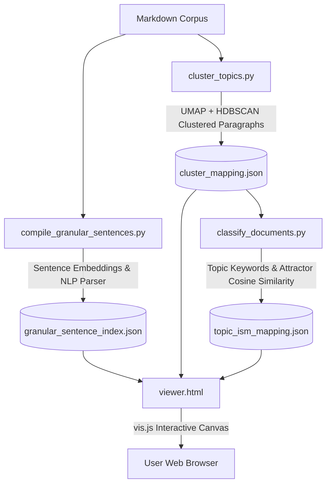

# Technical Architecture & Theory: Semantic Topic Linking & Hegemony Visualizer

This document explains the technical pipeline, mathematical formulations, and front-end interaction designs behind the **Semantic Topic Linking Engine** and the **2D/3D Linguistic Sentence Compass Visualizer** built for Vector Field Theory (VFT).

---

## 1. Architectural Overview

The visualizer system maps abstract philosophical, logical, and theological concepts into a unified coordinate field. It consists of a three-stage backend python pipeline and an interactive vanilla HTML5/JavaScript front-end.



---

## 2. Backend Pipelines & Data Processing

### A. Paragraph Clustering & Semantic Topic Modeling (The Semantic Graph)
**Script:** [cluster_topics.py](file:///e:/Vector%20Field%20Theory/VFT%20Docs/Semantic_Clusters/cluster_topics.py)  
**Output:** [cluster_mapping.json](file:///e:/Vector%20Field%20Theory/VFT%20Docs/Semantic_Clusters/cluster_mapping.json)

Instead of traditional document-level tags, this engine models *emergent semantic concepts* across paragraphs.

1. **Paragraph Embedding**: Encodes all paragraphs in the corpus into 384-dimensional dense vectors using `all-MiniLM-L6-v2`.
2. **Dimensionality Reduction (UMAP)**: Because high-dimensional spaces dilute distance metrics, the embeddings are compressed to **5 dimensions** using **UMAP (Uniform Manifold Approximation and Projection)** with a cosine metric, preserving the global structure and distance relationships.
3. **Density-Based Clustering (HDBSCAN)**: Runs **HDBSCAN (Hierarchical Density-Based Spatial Clustering of Applications with Noise)** on the 5D UMAP projections (with `min_cluster_size=15`, `min_samples=5`). This groups similar paragraphs into **semantic topics** (clusters) while identifying outlier paragraphs as noise (`topic_id: -1`).

---

### B. Topic Hegemony Classification
**Script:** [classify_documents.py](file:///e:/Vector%20Field%20Theory/VFT%20Docs/Semantic_Clusters/classify_documents.py)  
**Output:** [topic_ism_mapping.json](file:///e:/Vector%20Field%20Theory/VFT%20Docs/Semantic_Clusters/topic_ism_mapping.json)

Automatically runs as a post-process script after clustering.

1. **Consolidated Keyword Signatures**: For each cluster/topic, it extracts the top 15 words by frequency (filtering out custom stopwords) to form a **semantic keyword signature** (fingerprint) of the topic.
2. **Coordinate Alignment**: Embeds the keyword signatures and maps them to the description vectors of the 16 Hegemony Points via cosine similarity. Each topic is mapped to its dominant attractor, and the mappings are serialized for visualizer reference.

---

### C. Granular Sentence Parsing & Hegemony Projections (The Sentence Compass)
**Script:** [compile_granular_sentences.py](file:///e:/Vector%20Field%20Theory/VFT%20Docs/Semantic_Clusters/compile_granular_sentences.py)  
**Output:** [granular_sentence_index.json](file:///e:/Vector%20Field%20Theory/VFT%20Docs/Semantic_Clusters/granular_sentence_index.json) (240+ MB)

This script processes the corpus at the finest level of granularity (individual sentences). It supports **incremental builds** to skip already processed files.

1. **Paragraph & Sentence Extraction**: Splits markdown documents into paragraphs (double newlines) and then parses them into sentences using custom regex bound detector models to ignore decimal points and common abbreviations.
2. **Linguistic POS Classification**: Uses a **spaCy NLP pipeline** (`en_core_web_sm` POS tagger and dependency parser) with a regex fallback to classify each sentence into one of five categories:
   - **Axiom / Definition**: Sentences defining a concept using copulas or defining auxiliary verbs with subjects and complements (e.g., *"is defined as"*, *"represents the"*).
   - **Logic / Conditional**: Sentences expressing conditional rules, implications, or modals (e.g., *"if"*, *"then"*, *"should"*, *"implies"*, *"resolves"*).
   - **Example / Instance**: Sentences demonstrating concrete cases (e.g., *"for example"*, *"such as"*, *"e.g."*).
   - **Reference / Citation**: Sentences referencing figures, tables, or bibliography (e.g., *"[12]"*, *"see Fig. 2"*).
   - **Assertion**: Standard declarative statements (default fallback).
3. **Attractor Cosine Projections**: 
   - Embeds each sentence using a GPU-accelerated **SentenceTransformer** model (`all-MiniLM-L6-v2`).
   - Calculates the cosine similarity of the sentence embedding vector $u$ against the 16 coordinate vector descriptions $v_i$ representing the **Hegemony Points** (derived from combinations of Greater/Lesser Good/Evil quadrants):
     $$\text{Similarity}(u, v_i) = \frac{u \cdot v_i}{\|u\| \|v_i\|}$$
   - Appends direct Bible chapter/verse references (e.g., *"Matthew 22:12"*) when parsing scripture.

---

## 3. How the Semantic Overlap Graph is Generated

The semantic overlap mode maps documents based on **shared semantic concepts**. If two documents discuss similar themes, they are pulled together by physical forces; if they share nothing, they drift apart.

### Step 1: Mapping Topics to Documents
Each document is assigned a **Topic Set** ($T$) containing all the unique topics found in its paragraphs.
* For example, if Document A has paragraphs belonging to Topics 12, 42, and 95, then:
  $$T_A = \{12, 42, 95\}$$

**Node Size Rule**: The size of a document's circle in the visualizer is proportional to the number of unique topics it tracks ($|T|$). A larger circle means the document is more conceptually diverse.

---

### Step 2: Drawing the Links (The Edges)
To determine if two documents should be connected, the engine calculates two types of overlaps:

#### Type A: Direct Topic Overlap (Active Force Edges)
For any two documents ($d_1$ and $d_2$), we compare their topic sets ($T_1$ and $T_2$) using the **Jaccard Similarity Coefficient**:

$$J(T_1, T_2) = \frac{|T_1 \cap T_2|}{|T_1 \cup T_2|} = \frac{\text{Number of topics shared by both documents}}{\text{Total number of unique topics between them}}$$

* **If $J(T_1, T_2) > 0$**: The visualizer draws a purple line between the documents.
* **Physics & Attraction**: The Jaccard coefficient determines the strength of the connection. The visualizer runs a physics simulation (a force-directed layout). Stronger overlaps apply a stronger virtual "spring pull," dragging the related documents closer to each other on the screen.
* **Edge Width**: The line thickness is scaled by the similarity score:
  $$\text{Width} = J(T_1, T_2) \times 6$$

#### Type B: Passive Keyword Overlay (Underlay Edges)
To show weaker, vocabulary-level relationships without distorting the main layout:
1. We extract the unique keywords used in each document.
2. If two documents share **3 or more keywords** ($|K_1 \cap K_2| \ge 3$), a thin blue connection line is drawn.
3. **Physics Disabled**: These edges are set to `physics: false`. They do *not* exert any physical pull on the nodes, meaning they act as a visual reference guide rather than distorting the topic clusters.

---

## 4. Frontend Visualizer Canvas & Layout Modes

**File:** [viewer.html](file:///e:/Vector%20Field%20Theory/VFT%20Docs/Semantic_Clusters/viewer.html)  
**Engine:** vis.js Network Graph library, Vanilla HTML5, CSS Variables, Responsive Sidebar Panels.

### Layout View Modes
1. **Semantic Overlap (Direct/Keyword)**: Draws document-to-document nodes connected by edges that represent direct vocabulary overlap or shared keywords (as defined in Section 3).
2. **Hegemony Map Layouts**:
   - **Dominant**: Groups documents strictly around their primary Hegemony attractor.
   - **Spread**: Maps documents to multiple attractors based on a user-controlled similarity threshold slider.
   - **Granular**: Plots individual documents mapped directly to coordinate points.
3. **Linguistic Sentence Compass**:
   - Renders individual sentences from a selected document as nodes in a 2D field.
   - Color-codes sentence nodes by their linguistic class (Axiom, Logic, Example, Reference, Assertion).
   - Generates force-directed connection lines linking sentence nodes to their coordinate attractor points (representing their semantic gravity).
   - Shows parsed Bible references directly in the inspector card.

---

## 5. The Tri-State Toggle Interaction Model

To analyze coordinates without visual clutter, we implemented a **tri-state toggle interaction** on the hegemony coordinate legend in the sidebar sentence inspector card:

```
[Coordinate Clicked]
        │
        ├── State 1: DOMINANT ATTRACTOR MODE
        │   └── Highlights ONLY nodes/edges where this coordinate is the highest similarity %
        │   └── Shows "DOMINANT" badge and solid border on sidebar row
        │
        ├── State 2: GRADIENT MODE
        │   └── Opacity-scales all sentences and edges proportional to similarity strength
        │   └── Shows "GRADIENT" badge and dashed border on sidebar row
        │
        └── State 3: OFF / RESET
            └── Restores default colors, opacities, and clears sidebar indicators
```

### Core Design Rules
* **No Camera Disruptions**: Clicking coordinate projections applies highlighting *instantly* without triggering camera zoom, centering, or disrupting the network focus.
* **Graph Click Isolation**: Node selections on the graph field only populate the sidebar inspector card and do *not* trigger selection darkening.
* **Canvas Reset**: Clicking the canvas background resets all active highlighting and clears sidebar projection row styles.

---

## 6. How to Run the Visualizer

1. Open a terminal in the project directory.
2. Run the HTTP server:
   ```bash
   python Semantic_Clusters/start_viewer.py
   ```
3. Open your browser and navigate to [http://localhost:8000/viewer.html](http://localhost:8000/viewer.html).
