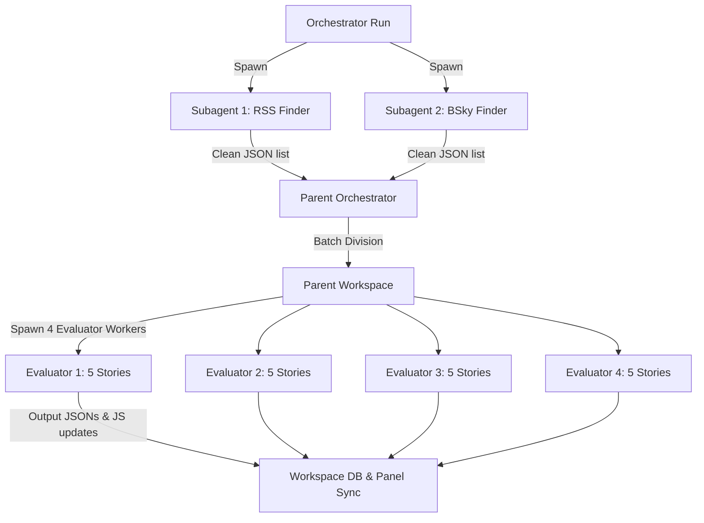

# Plan: Subagent Batch Evaluation & Token Optimization Architecture

This document outlines the architectural plan for implementing a high-throughput, token-optimized **Subagent Batch Evaluation Loop** for the Aletheia Bot. It details how to programmatically scale the discovery and evaluation of news articles and Bluesky posts while maintaining strict token efficiency limits.

---

## 1. Core Objectives
* **Isolate Web-Search Bloat:** Prevent expensive, garbage-heavy HTML/markdown web browsing context from contaminating the high-prestige Actualism evaluation prompts.
* **Avoid Quadratic Context Build-up:** Eliminate the conversational history "tax" that accumulates when a single agent evaluates multiple articles in sequence.
* **Pragmatic Concurrency:** Establish optimal worker-agent bounds to prevent workspace conflicts, API rate spikes, and startup lag.

---

## 2. Division of Labor (Finder vs. Evaluator Subagents)

To preserve tokens, the system segregates retrieval (high search bloat, low reasoning complexity) from evaluation (low text footprint, high conceptual reasoning complexity).



### A. Finder Subagents (Role: Search & Extract)
* **Goal:** Scrape 10–20 raw candidates from Bluesky or RSS feeds.
* **Behavior:** They are permitted to run high-volume web searches and scraping tools.
* **Output Standard:** They must output a single, strictly formatted candidate list containing *only* `{ "subject": "...", "link": "...", "text": "..." }` and immediately terminate, discarding their search-bloat context.

### B. Evaluator Subagents (Role: Gnostic Actualism Evaluation)
* **Goal:** Evaluate a batch of clean inputs and compile dry-run threads.
* **Behavior:** They never perform web searches or browse. They inherit *only* the specific Actualism framework instructions and their assigned story texts.

---

## 3. Mathematical Bounds for Batch Allocation

We evaluate the cumulative input token footprint for processing $N = 20$ stories across different subagent worker counts ($P$) and batch sizes ($M = N/P$).

Let:
* $S = 5,000$ tokens (System Prompt + personae schema overhead).
* $C = 1,500$ tokens (Clean story text context).
* $A = 1,200$ tokens (Generated dry-run thread response).

The cumulative cost of processing the batch is given by:
$$\text{Total Tokens} = N \cdot S + \frac{N(M+1)}{2} C + \frac{N(M-1)}{2} A$$

### Token Efficiency Analysis Table ($N = 20$):

| Strategy | Number of Workers ($P$) | Batch Size ($M$) | Mathematical Formula | Projected Token Footprint | Token Savings vs Monolithic |
| :--- | :--- | :--- | :--- | :--- | :--- |
| **Monolithic** | 1 subagent | 20 stories | $20S + 210C + 190A$ | **$643,000$ tokens** | *0% (Baseline)* |
| **Pragmatic Batch** | 4 subagents | 5 stories | $20S + 60C + 40A$ | **$238,000$ tokens** | **63% Saved** |
| **Micro Batch** | 7 subagents | 3 stories | $20S + 40C + 20A$ | **$184,000$ tokens** | **71% Saved** |
| **Pure Parallel** | 20 subagents | 1 story | $20S + 20C$ | **$130,000$ tokens** | **80% Saved** |

### The Batch Sweet Spot: $M = 3$ to $5$ Stories
While $M=1$ is the absolute theoretical minimum for tokens, running 20 individual parallel subagents results in severe thread execution overhead and file-write collisions when updating the shared `stories_registry.js` database. 

We designate **5 stories per subagent ($P = 4$)** as the optimal pragmatic engineering baseline, balancing extreme token savings ($63\%$) with absolute system stability.

---

## 4. Execution Blueprint (`orchestrate_batch.py`)

A single Python orchestration script will automate this subagent pipeline under the hood:

```python
import os
import json
import time
from concurrent.futures import ThreadPoolExecutor

def run_retrieval_subagents():
    print("Spawning Finder subagents to harvest candidate news posts...")
    # Spawn 1 research subagent for RSS (10 candidates)
    # Spawn 1 research subagent for Bluesky feed (10 candidates)
    # Discard search logs, return clean JSON of 20 targets.
    candidates = [...] 
    return candidates

def run_evaluator_subagent(worker_id, story_batch):
    print(f"Worker {worker_id} starting evaluation of batch (Size: {len(story_batch)})...")
    # Spawn stateless 'self' subagent.
    # Feed stories sequential evaluation prompts.
    # Write back factcheck_[id].json and update stories_registry.js.
    return True

def main():
    # 1. Harvest candidates cheaply
    candidates = run_retrieval_subagents()
    
    # 2. Divide 20 stories into 4 batches of 5
    batch_size = 5
    batches = [candidates[i:i + batch_size] for i in range(0, len(candidates), batch_size)]
    
    # 3. Process batches concurrently using worker threads
    print("Initiating parallel Actualism evaluations...")
    with ThreadPoolExecutor(max_workers=len(batches)) as executor:
        futures = []
        for worker_id, batch in enumerate(batches, 1):
            futures.append(executor.submit(run_evaluator_subagent, worker_id, batch))
            
        # Wait for all workers to complete
        for future in futures:
            future.result()
            
    print("\nBatch evaluation completed! All 20 runs successfully generated and viewer updated.")

if __name__ == "__main__":
    main()
```
