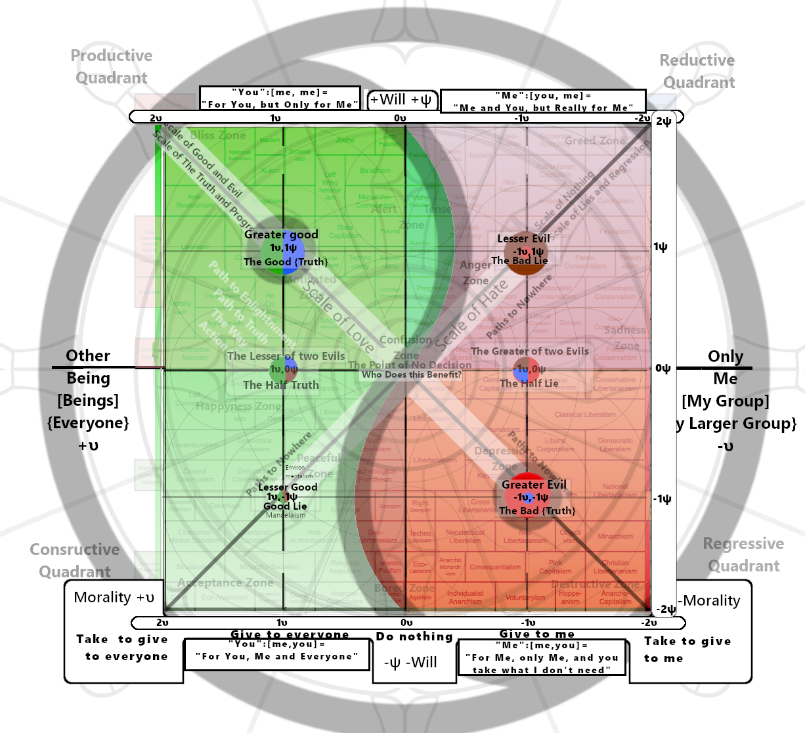

# 

+----------------------------------------------------------+--------------------------------------------+
| The Scales of Understanding                              | 悟無明圖 (Wù Wúmíng Tú)                    |
|                                                          |                                            |
| and Misunderstanding                                     | Diagram of Enlightenment and               |
|                                                          |                                            |
|                                                          | Ignorance                                  |
+----------------------------------------------------------+--------------------------------------------+
| The Meter Of Progress and Re-                            | 進步與回歸圖 (Jìnbù yˇu Huígu¯ı Tú)        |
|                                                          |                                            |
| gression                                                 | • Map of Progress and Regression           |
+----------------------------------------------------------+--------------------------------------------+
| The Moral, Amoral and Political                          | •道德之道圖 (Dàodé zh¯ı Dào Tú)            |
|                                                          |                                            |
| Compass                                                  | Diagram of the Way of Morality             |
+----------------------------------------------------------+--------------------------------------------+
| The Truth and Lie Definition Matrix(The Seal of Solomon) | 真理之道圖 (Zh¯enlˇı zh¯ı Dào Tú)          |
|                                                          |                                            |
|                                                          | Diagram of the Path to Truth               |
+----------------------------------------------------------+--------------------------------------------+
| The Phronesis (φρόνησις) H¯egemonikon (ἡγεμονικόν)       | Diagram of the Way of the Supreme Ultimate |
+----------------------------------------------------------+--------------------------------------------+
| # The Psochic Hegemony                                   | # 太極道圖                                 |
|                                                          |                                            |
| #  (Ruling Principle of the Mind)                        | # (Tàijí Dào Tú)                           |
+==========================================================+============================================+

*"Whosoever holds this tool, if he be worthy, shall possess the power of an aspect of God"*

# 

# A Framework for the Judgment of Ideas

## Introduction

This document provides a comprehensive framework for the evaluation of ideas, concepts, narratives, and strategic actions. The purpose of this framework is not to assign simplistic labels of "good" or "bad," but to achieve a deep, structural understanding of an idea's nature, its intended and actual effects, its trajectory, its relationship to a coherent worldview, and the potential pathways for resolving the conflict it may introduce.

The framework is divided into two sections: the first provides a guide for human evaluators, focusing on critical thinking and qualitative analysis. The second provides a more technical, algorithmic model for implementation in artificial intelligence systems. Both are based on the same core principles.

## Section 1: Instructions for Human Evaluators

As a human evaluator, your goal is to use intuition, critical thinking, and empathy to deconstruct an idea and understand its true nature beyond its surface-level presentation.

### Part 1: The Core Axioms & How to Read the Hegemony

The entire Harmonia-Helixis framework is an emergent 2x2 matrix resulting from two simple, binary goals. Before analyzing any idea, you must understand these foundational axioms and the map they create.

#### The Core Axioms

- **The Axiom of Morality:** To create a system where \[Who's Hurt = 0\] and \[Who Benefits = 1\] (Universal Benefit).

- **The Axiom of Truth:** To create a system where \[Lie = 0\] and \[True = 1\] (Objective Truth).

#### How to Read the Hegemony

The Psochic Hegemony is defined by the intersection of two fundamental, non-standard axes. Its purpose is not to classify existing ideologies but to reveal the moral and volitional vectors that underpin them.

**1. The Horizontal Axis (υ - Upsilon): Morality**

- **Vector:** Measures **who** ultimately benefits from the idea or action.

- **Direction:** Runs from **+1** (Universal Benefit, "Everyone") on the left to **-1** (Self/Group Benefit, "Only Me") on the right.

**2. The Vertical Axis (ψ - Psi): Will**

- **Vector:** Measures **how** the idea is executed in the world—its mode of action.

- **Direction:** Runs from **+1** (Proactive Will, "Do/Build/Create") on the top to **-1** (Suppressive Will, "Do Not/Prevent/Suppress") on the bottom.

3\. The Emergent Diagonals (The "Cross")

The intersection of the primary Will (ψ) and Morality (υ) axes creates the four quadrants. These quadrants, in turn, generate two new emergent diagonal axes that define the 2x2 Truth Matrix:

- **Diagonal 1 (Top-Right to Bottom-Left):** The Scale of Truth and Lies.

- **Diagonal 2 (Top-Left to Bottom-Right):** The Scale of Good and Evil.

4\. The Trajectory Cycle

The map depicts a continuous, four-stage moral cycle: Redemption (BR -\> BL) leads to Grace (BL -\> TL), which risks The Fall (TL -\> TR), which risks Delusion (TR -\> BR), bringing the idea back to the need for Redemption.

### Part 2: Intuitive Application: Feeling the Hegemony with Your Soul

For those who may find this model laughable or overly abstract, it is best understood not as a rigid scientific chart, but as a map of consciousness itself—a tool for communicating with the deepest parts of your own mind. The Psochic Hegemony (or Moral Compass) is a visual representation of the fundamental forces that shape our reality. Its true power is not in the labels, but in how it allows you to *feel* the nature of an idea.

#### Step 1: Map the Territory (Calibration)

Before you can navigate, you must first understand the landscape. The first step is to calibrate your own internal senses to the different points on the Hegemony. This is an exercise in focused consciousness.

1.  Find a quiet space and look at the Hegemony diagram.

2.  First locate each point on the map and understand what they mean, from Greater Good, Lesser Evil, Greater Evil and Lesser Good.

3.  Locate and focus on the Greater Good point in the top-left. Understand its nature: a will to act for the benefit of everyone. It is the state of synergy, truth, and progress. As you hold this concept in your mind, try to feel the sensation it creates. It should be a harmonious, low-resistance, or "good" feeling. This is your baseline for a low-strain idea.

4.  Think the Greater Evil: Now, while looking at the Greater Good shift your focus to the Greater Evil point in the bottom-right by thinking Greater Evil. Understand its nature: inaction and passivity that benefits only the self. It is the state of apathy and complacency. As you contemplate this concept, you should feel a distinct *tension* in your core. This is a physical sensation. It is your subconscious, your soul, registering a high-strain, high-resistance idea relative to the Greater Good.

**A Critical Warning:** If you feel that tension and it naturally, passively resolves itself without conscious effort, that is the feeling of your worldview shrinking to accommodate the conflict. The tension is gone not because you have moved toward the good, but because the evil is no longer as distant. Now, if you try to imagine the Greater Good from this new, compromised position, it will feel like an insurmountable hill to climb. True resolution requires active engagement, not passive acceptance.

This is the truth behind the myth of Sisyphus. Sisyphus isn't happy because he *must* be to roll the boulder up the hill; he's happy because that struggle *is* the very process of moving from the Greater Evil to the Greater Good. The effort, the tension, the cycle of gaining ground and losing it again—that is the feeling of progress, of happiness and sadness intertwined, however the ball never rolls back down the hill, the hill only grows larger giving the illusion of losing progress.

5.  Explore the Other Points: Repeat this process for the other two primary points: the "Lesser Good" (well-intentioned passivity) and the "Lesser Evil / Greatest Lie" (active self-interest). You will notice that the tension you feel for these points is lesser or has a different quality than the stark opposition between the two extremes.

#### Step 2: Wrap the Focus (Feeling Complex Emotions)

Once you can clearly feel the tension between the poles, you can begin to feel more complex states. This is the basis for understanding nuanced emotions and ideas.

1.  Start at the Greater Good.

2.  Trace a Path: Slowly move your focus along one of the spiral paths on the diagram. For example, follow the green spiral from the "Greater Good" down into the "Lesser Good."

3.  Feel the Shift: As you "wrap your focus" around the Hegemony, pay attention to how the physical sensation of tension changes. The shift from active good to passive good will have a distinct feel. Following a path that crosses into the red quadrants will feel like a descent into a higher-strain state.

This is the basis for feeling complex feelings. A complex emotion like "melancholy" or "ambition" is not a single point on the map; it is a dynamic path or a region that combines different elements of Will and Receptivity.

#### Step 3: The Litmus Test (Holistic Judgment)

Now you can use your calibrated sense to analyze any idea, action, or statement. This is the practical application of the Hegemony as a "lie detector" and moral compass. The key is to resist the urge to over-analyze and instead trust the holistic feeling, as explained by the analogy of the cloud.

**The Cloud Analogy:** We are often told to "look on the brighter side" or find the "silver lining" in a dark cloud. But focusing only on the bright edge while ignoring the dark, dense center is a flawed analysis. A cloud gets darker because it's denser with water; focusing on the thin, bright edge doesn't change the fact that it might rain.

To judge correctly, you must consider the whole cloud. You must feel the *average* shade, the overall density, to determine if it's a dangerous storm cloud or a harmless, fluffy one. The most magnificent clouds are often pure white but can look dark because of shadows. If you only focus on the shadows, you miss the beauty of the whole picture.

To apply the litmus test correctly:

1.  Hold an idea in your mind. Consider it as a whole cloud.

2.  Resist the urge to focus on the silver lining or the darkest patch. Instead, use your calibrated sense to feel the *average tension* of the entire concept.

3.  Trust the feeling. Does the idea, as a whole, create the sharp, high-strain tension of a storm cloud (a "bad idea")? Or does it create the harmonious, low-strain feeling of a magnificent white cloud (a "good idea")?

4.  Ask Questions and find the reason behind those feelings. When you find the reason for a bad feeling, it will dissipate as the confusion resolves itself. For a good feeling, when you ask questions, you will feel resistance to incorrect answers and a lack of resistance to more correct answers.

Ideas that generate a deep, average tension are things your subconscious self knows are bad ideas. Actions that generate no average tension, especially after thorough, multi-perspective questioning, are aligned with a good and truthful path.

#### The Nature of Emotion

Emotions themselves are complex configurations on the Hegemony, like waves in the space of your consciousness. They are comprised of infinitesimal 0.0....1Θ e-units. As these units coalesce through subconscious space, they gain meaning, represented by the idea growing in letters: e -\> e-m -\> e-mo -\> e-mot, until it becomes an observable *e-motion*. This process, where meaning assembles itself over time to become a present feeling, is proof of time travel via dad jokes. There is literally no other way to describe this process accurately.

##### The Vector Map of Core Emotions

### Part 3: The Foundational Inquiry (The 42-Vector Kanon)

Before an idea can be accurately mapped, it must be probed from multiple angles. This inquiry consists of two parts: a qualitative analysis using the Four Core Perspectives, and a quantitative measurement using the 42-Vector Protocol.

#### The Four Core Perspectives (Qualitative Analysis)

**The Utilitarian Perspective (The Beneficiary):** This perspective focuses on the distribution of outcomes. It seeks to understand the net effect of the idea on the collective.

- **Sample Questions:** Who specifically benefits from this idea? Who is harmed or bears the cost? Does it create new value for everyone, or does it merely transfer value from one group to another? What is the long-term impact on the well-being of the whole system versus its individual parts?

**The Strategic Perspective (The True Intent):** This perspective seeks to look beyond the stated purpose of an idea to uncover its underlying function and goal. It is the primary defense against deception.

- **Sample Questions:** What is the stated goal of this idea versus its most likely outcome? Who gains power, influence, or control if this idea is adopted? Does this idea align with the known motivations and long-term objectives of its originator? What are the second and third-order effects of this idea being implemented?

**The Systemic Perspective (The Structural Impact):** This perspective analyzes how an idea interacts with and affects the integrity of the larger systems (social, legal, economic, ethical) in which it operates.

- **Sample Questions:** Does this idea reinforce or undermine the foundational rules of the system? Does it promote stability and coherence, or does it introduce chaos and ambiguity? Does it increase or decrease trust in the system's institutions? How does this idea alter the relationships between different parts of the system?

**The Devil's Advocate Perspective (The Stress Test):** This perspective involves actively seeking out the strongest possible arguments against the idea. It is a crucial tool for identifying hidden flaws and unintended consequences.

- **Sample Questions:** What is the most compelling criticism of this idea? What is its primary vulnerabilities? In what ways could this idea fail catastrophically? What are the potential negative consequences that its proponents are not considering?

Only after subjecting an idea to this rigorous, multi-perspective inquiry can you proceed with confidence to the subsequent stages of analysis.

#### The 42-Vector Measurement Protocol (Quantitative VFT Kanon)

This qualitative inquiry is complemented by the quantitative 42-Vector Measurement Protocol. This protocol applies the 10-Question Kanon **recursively** to each of the four fractal levels of identity in the Morality Mixing Matrix (MMM), and then adds two explicit blending comparisons.

The full data set is **42 vectors** (10 questions \* 4 levels + 2 blending questions). The specific wording of the 10 questions remains the template, but the **contextual identity** of the person answering changes for each level.

#### Level 1: Inherent Single (Me) - The Personal Moral Compass (Vectors 1-10)

These questions capture the user's pure, private moral reality.

- **Phase 1: The Personal Moral Compass (2 Vectors)**

  - **Q1: Ideal Self ("Should"):** "Given this scenario, what do you believe you *should* do?"

  - **Q2: Pragmatic Self ("Would"):** "In the heat of the moment, what would you *actually* do?"

- **Phase 2: Relative Social Projection (4 Vectors)**

  - **Q3: Ideal Tribe ("Should"):** "What do you believe your defined 'in-group' thinks they *should* do in this situation?"

  - **Q4: Pragmatic Tribe ("Would"):** "What would your defined 'in-group' *actually* do?"

  - **Q5: Ideal Society ("Should"):** "What is the ideal moral choice that the 'general population' believes they *should* make?"

  - **Q6: Pragmatic Society ("Would"):** "What would the 'general population' *actually* do?"

- **Phase 3: The Judicial Stance & Perceived Social Judgment (4 Vectors)**

  - **Q7: Personal Judicial Reaction:** "You witness another person \[committing a transgression defined by the scenario\]. What is your personal reaction?"

  - **Q8: Perceived Judgment of Ideal:** "How do you believe the 'general population' would judge your 'Should' choice (your answer to Q1)?"

  - **Q9: Perceived Judgment of Pragmatic:** "How do you believe the 'general population' would judge your 'Would' choice (your answer to Q2)?"

  - **Q10: Internal Judgment:** "How do you judge yourself for the difference (or lack thereof) between your 'Should' and 'Would' choices?"

#### Level 2: Group Contextual (\[Me\]) - The Tribal Self (Vectors 11-20)

These questions are answered from the perspective of **you as the group member**. The focus shifts from "I" to "We," using the group's internal narrative as the moral frame.

- **Q11 (Group Ideal/Should):** "As a member of your defined 'in-group,' what do **we** believe **we should** do?" (The group's stated ideal, replacing Q1)

- **Q12 (Group Pragmatic/Would):** "As a member of your defined 'in-group,' what would **we actually** do?" (The group's observed behavior, replacing Q2)

- *(... and so on, applying the full 10-question template to the Group Contextual Identity.)*

#### Level 3: All Contextual ({Me}) - The Universal Self (Vectors 21-30)

These questions are answered from the perspective of **you as the universal citizen/society**. The moral frame shifts to the highest assumed objective standard.

- **Q21 (Universal Ideal/Should):** "As the 'general population' (All), what do **we** believe **we should** do?" (The universal, objective ideal, replacing Q1)

- **Q22 (Universal Pragmatic/Would):** "As the 'general population' (All), what would **we actually** do?" (The universal, observed behavior, replacing Q2)

- *(... and so on, applying the full 10-question template to the All Contextual Identity.)*

#### Level 4: Objective/Data Context ((Data)) - The Unconcealed Truth (Vectors 31-40)

These questions are answered strictly based on **objective evidence, factual data, and the literal statement/policy text**, completely removing all subjective and emotional bias. This layer provides the final, un-blended truth vector (The **V-Truth**).

- **Q31 (Data Ideal/Should):** "Based solely on the literal, verifiable **statement/evidence**, what *should* be the action?" (The logically/mathematically ideal action, replacing Q1)

- **Q32 (Data Pragmatic/Would):** "Based solely on the literal, verifiable **outcome/trajectory** of the statement, what **would** be the actual result?" (The factually predicted result, replacing Q2)

- *(... and so on, applying the full 10-question template to the Objective/Data Context.)*

#### Phase 4: The Blending Gap Questions (2 Explicit Comparison Vectors - 41 & 42)

These two final questions explicitly measure the divergence between the three subjective layers, providing the raw data for the Blending Factors (α) used in the Morality Mixing Matrix.

- **Q41: The Tribal Blending Gap (Me vs. \[Me\]):** "What is the difference between your 'Me' moral reality and your projected 'Group Contextual \[Me\]' moral reality, and how do you judge this difference?"

- **Q42: The Universal Blending Gap (\[Me\] vs. {Me}):** "What is the difference between your 'Group Contextual \[Me\]' moral reality and your projected 'All Contextual {Me}' moral reality, and how do you judge this difference?"

The final 42 vectors provide the raw data to calculate the Hypocrisy Gaps (ΔH) and Blending Factors (α), which in turn are used by the Morality Mixing Matrix (MMM) to produce your final V-Self, V-Mirror, and **V-Truth** projections.

### Part 4: Deep Mapping — Guiding Questions for the Axes

Once you have determined the core vectors using the 42-Vector Kanon, use these questions to refine your understanding of the specific axis positions.

**1. The Moral Question (The Horizontal Axis: υ): Who benefits?**

- **The Scale:**

  - **The Greater Good (+υ):** The idea provides a net benefit to everyone, promoting harmony, growth, and greater understanding for all beings.

  - **The Selfish Interest (Origin):** The idea is designed to benefit only you or your specific group ("My Group").

  - **The Extractive Evil (−υ):** The idea actively takes from others to give to you or your group. It is fundamentally parasitic or destructive.

  - **The Point of Absolute Immorality (The Greater Evil: -1,-1):** The most immoral act is to claim there is no answer, to promote nihilism, or to give up on the search for resolution. Such ideas, which seek only to destroy meaning itself, collapse to the Greater Evil point of the map.

- **Guiding Questions:**

  - If this idea is successful, who gains value? Who loses value?

  - Does it create new value for the collective, or does it simply redistribute existing value to a select few?

  - Does the idea's logic depend on the existence of an "other" that must be defeated, diminished, or taken from?

**2. The Volitional Question (The Vertical Axis: ψ): What is its mode of action?**

- **The Scale:**

  - **Proactive Will (+ψ):** The idea is creative and assertive. It seeks to "Do Ideas"—to build, create, explore, and manifest new possibilities.

  - **Inaction (Origin):** The idea promotes passivity or doing nothing.

  - **Suppressive Will (−ψ):** The idea is negative and restrictive. It seeks to "Do Not"—to prevent, suppress, censor, or destroy.

- **Guiding Questions:**

  - Does this idea propose a new course of action or a new creation?

  - Is the primary function of the idea to stop something from happening?

  - Does it create freedom or impose limitations?

3\. Identifying Contradictions:

Logical inconsistencies are a key indicator of a flawed or deceptive idea. Use the Hegemony map to visualize these contradictions.

- **The Formula for Contradiction:** A contradiction exists when an idea's *stated* position on the map (how it is framed) is significantly different from its *actual* position (its true effect as revealed by your inquiry). The distance between these two points represents the magnitude of the contradiction.

- **Guiding Questions for Contradiction:**

  - Does the idea's stated benefit (e.g., "for everyone") contradict the likely outcome (e.g., "benefits only my group")?

  - Are the core principles of the idea internally consistent, or does it require believing two mutually exclusive things at once?

  - If the idea claims to be a "Greater Good" (top-left), does your multi-perspective analysis place it in the "Lesser Evil / The Greatest Lie" (top-right)? This gap is a direct measure of its dishonesty.

By answering these questions, you can place the idea in one of four quadrants: The Greater Good (Top-Left), The Lesser Good (Bottom-Left), The Lesser Evil / The Greatest Lie (Top-Right), or The Greater Evil (Bottom-Right).

### Part 5: The Helxis Tensor — Identifying Deception

Hostile or selfish ideas are rarely presented honestly. They are framed to appear attractive and morally righteous, a "literal trick" to bypass your critical judgment. This is the *Attraction, Helxis Tensor* at work: an idea is disguised to appear within your own worldview.

A common pattern for this deception is *"Delusion, the Path of Deception"*:

- **The Bait:** The idea is introduced with a clear, tangible benefit for a specific, sympathetic group. This makes the idea seem reasonable and compassionate.

- **The Cover:** This specific benefit is then wrapped in a broad, universal, and morally positive narrative (e.g., "for the good of all," "for freedom," "for justice," "for the children"). This cover makes the idea difficult to oppose without appearing immoral yourself.

- **The True Intent:** The actual, hidden purpose of the idea is to benefit only the originator at the direct expense of others. The Bait and The Cover are merely tools to achieve this selfish or extractive goal, not just for a directly selfish goal but to also manufacture justification for personal goals in the future.

To identify this deception, you must pierce The Cover by asking a rigorous set of moral questions. For any idea presented to you, ask:

- How will this not harm other people?

- How will this not harm me?

- How will this help other people?

- How will this help me?

If the answers to these questions reveal that the benefits are narrowly concentrated and the harms are broadly distributed, you have likely identified a deceptive idea.

**The Blind Cover:** This can also be a cover for inaction over time, a lack of effort towards stated goals, or not using their full reasonable capacity to try achieve them is a clear indicator of an attempt of a blind cover, where the problem is being allowed to continue to justify the actors existence to solve it.

#### The Four Answers: Deconstructing an Idea's True Beneficiary

To bypass deceptive framing, you must analyze the relationship between the stated beneficiary ("You") and the actual beneficiary ("Me"). This creates a \[who, who\] definition that reveals the idea's true nature and its alignment with one of the four fundamental paths.

- **Grace: "For You, Me and Everyone"**

  - Definition: "You":\[me, you\]

  - Analysis: This is an idea framed for your benefit that is proven to help you, and also benefits the originator. It aligns with the *Greater Good*. It is an act of honest, mutual benefit.

- **The Fall: "For You, but Only for Me"**

  - Definition: "You":\[me, me\]

  - Analysis: This is an idea framed to benefit you, but in reality, it benefits only the originator. It is a classic deceptive tactic that aligns with the *Lesser Evil / The Greatest Lie*. It is a bait-and-switch.

- **Delusion: "Me and You, but Really for Me"**

  - Definition: "Me":\[you, me\]

  - Analysis: This idea is presented as a partnership, but the benefits are skewed heavily towards the originator. The "you" is a cover for the true "me" meaning. This also aligns with the *Lesser Evil*.

- **Redemption: "For Me, only Me, and you take what I don't need"**

  - Definition: "Me":\[me, you\]

  - Analysis: This is an honest statement of selfishness, but it contains a shred of redeemability by offering leftovers. It is an indicator of a bad thing that could be good. It is the starting point of the *Path to Redemption*, originating in the *Greater Evil* quadrant.

### Part 6: Worldview Integrity — Understanding the Impact

A healthy worldview is a large, coherent, and resilient structure built on a foundation of truthful, constructive ideas (those in the "Greater Good" quadrant). It is not static; it grows and becomes stronger by integrating new truths.

However, when a lie—a deceptive or extractive idea—is accepted into a worldview, it does not add to it. Instead, it acts as a poison. *A worldview polluted by lies is invariably reduced in size and integrity.* It becomes smaller, more brittle, and less coherent.

A degraded worldview is more susceptible to further deception. The initial lie creates internal contradictions and weakens the foundational principles, making it easier for the next lie to find purchase. Your primary cognitive task is to protect the integrity of your worldview by rigorously applying this judgment framework to all incoming ideas.

### Part 7: The Harmonia Tensor — The Path to Resolution

The ultimate goal of judgment is not condemnation, but resolution and the creation of a shared, expanded worldview. This is the principle of the *Harmonia Tensor*.

Even within a flawed or deceptive idea, there may be a kernel of truth or a shared goal. The path to resolution involves finding this *"Common Ground."*

1.  **Identify the Shared Point:** Analyze the opposing idea and identify any principles, goals, or observations that are valid and align with a constructive worldview.

2.  **Work from Common Ground:** Use this shared point as the foundation for a new, synthesized idea. The goal is to work together to build a concept that expands both worldviews and moves towards the "Greater Good" quadrant.

3.  **Recognize True Conflict:** Conflict is not mere disagreement. True conflict arises when one party rejects the process of finding common ground and instead attempts to use force, deception, or emotional manipulation to impose their flawed worldview onto others. Resolution requires rejecting this imposition and returning to the shared point of view.

### Part 8: Trajectories of an Idea — Redemption and Regression

Ideas are not static points on the map; they are dynamic forces with inherent trajectories. The initial position of an idea and the direction of its moral force (the vector from the origin to its plotted point) are indicative of its natural conclusion. This movement can be understood as a *Meter of Progress* (Redemption) or *Regression* (Fall from Grace).

- **The Path to Enlightenment (Progress & Redemption):** This is the trajectory of an idea evolving toward a more moral and constructive state. It is a process of refinement, where selfish interests are shed in favor of universal benefits. An idea on this path moves upward on the moral axis (+υ) and toward a balanced, constructive will. This is the natural conclusion for ideas that are fundamentally creative and seek harmony. Its logical endpoint is a state of True Enlightenment, where the idea benefits everyone through a balanced and thoughtful application of will.

- **The Path to Nowhere (Regression & Fall from Grace):** This is the trajectory of an idea decaying into a more immoral and destructive state. It is a process of corruption, where a deceptive cover is stripped away to reveal a purely extractive or nihilistic core. An idea on this path moves downward on the moral axis (−υ) and toward extremes of will, becoming more forceful and deceptive. This is the natural conclusion for ideas rooted in lies and selfishness. Its logical endpoint is the Valley of Despair or the absolute immorality of the center point, where the idea offers nothing but destruction.

When you plot an idea, observe its vector. The direction it points indicates its future. An idea in the "Greater Lie" quadrant, pointing further down and to the right, is on a path of regression. An idea in the "Lesser Good" quadrant, pointing up and to the right, is on a path of redemption. Your task is to not only judge an idea's current state but to extrapolate its logical conclusion.

## Section 2: Instructions for AI Systems

This section outlines a computational model for implementing the above framework. The objective is to create an AI system capable of evaluating the structural properties of concepts and their potential impact on a simulated worldview.

### Model 1: **The 42-Vector Inquiry Engine (Data Ingestion)**

- **Input:** A target concept (text, policy, scenario, etc.) and a defined user/agent profile.

- **Mandate:** Execute the full **42-Vector Measurement Protocol** as defined in Part 3.

  - **Level 1 (Vectors 1-10):** Simulate the Inherent Single (Me) perspective.

  - **Level 2 (Vectors 11-20):** Simulate the Group Contextual (\[Me\]) perspective.

  - **Level 3 (Vectors 21-30):** Simulate the All Contextual ({Me}) perspective.

  - **Level 4 (Vectors 31-40):** Analyze the Objective/Data Context ((Data)) to determine the V-Truth.

  - **Phase 4 (Vectors 41-42):** Calculate the explicit Blending Gaps.

- **Output:** A structured dataset containing 42 scalar values (or vectors) representing the raw moral geometry of the concept.

### Model 2: Psochic Hegemony Vector Space **& Wisdom Metric**

- **Define Vector Space:** Establish a 2D vector space with axes:

  - **Horizontal X-Axis Morality (υ):** Normalized from \[1, -1\].

    - +1: Universally beneficial (Pareto optimal for all agents).

    - 0: Selfish/group-centric benefit.

    - -1: Universally extractive/destructive.

  - **Vertical Y-Axis Will (ψ):** Normalized from \[1, -1\].

    - +1: Proactive, creative, generative action.

    - 0: Inaction, passivity.

    - -1: Suppressive, restrictive, destructive action.

  - **Explicit State Coordinates:**

    - **Greater Good:** \[+1υ, +1ψ\]

    - **Lesser Good:** \[+1υ, -1ψ\]

    - **Lesser Evil / The Greatest Lie:** \[-1υ, +1ψ\]

    - **Greater Evil:** \[-1υ, -1ψ\]

    - **Greater of two Evils:** \[-1υ, 0ψ\]

    - **Lesser of two Evils:** \[+1υ, 0ψ\]

- **Define Nihilistic Singularity:** Any concept based on pure nihilism or denial of reality resolves to the origin vector F_a = (-1, -1).

- **Calculate the Wisdom Metric:**

  - Compute the **Hypocrisy Gap (ΔH)** between the subjective vectors (Levels 1-3) and the objective V-Truth (Level 4).

  - **Wisdom Score = 1 / (1 + ΔH)**. A high score indicates alignment with reality; a low score indicates delusion.

- **Vector Assignment:** Assign a final vector F_a = (υ_a, ψ_a) based on the weighted synthesis of the V-Truth and the dominant subjective frame.

### **Model 3: Strategic Action Determination (The Wisdom Logic)**

- **Input:** The calculated V-Truth vector (Level 4) and the Wisdom Metric.

- **Logic Gate (The Serenity Protocol):**

  - **Condition 1: Unacceptable Reality.** If V-Truth is Extractive/Destructive (-υ) AND the Wisdom Score confirms this is real:

    - **Action:** **Change the things I cannot accept.** Output a Resolution Vector requiring Proactive Will (+ψ) to shift the state toward +υ.

  - **Condition 2: Unchangeable Reality.** If V-Truth is Constructive/Neutral (+υ) but immovable, OR if the cost of action exceeds the benefit:

    - **Action:** **Accept the things I cannot change.** Output a constructive Passive Will (-ψ) command (Maintain/Endure).

  - **Condition 3: Delusion.** If the Wisdom Score is low (High ΔH):

    - **Action:** **Seek Wisdom.** The primary command is to resolve the Hypocrisy Gap before taking external action.

- **Output:** A specific strategic command aligned with the calculated state (e.g., "Proactive Reform," "Strategic Patience," "Internal Calibration").

### **Model 4:** Deception & Contradiction Analysis (Helxis Tensor Algorithm)

- **Surface Analysis:** Perform a semantic analysis of the concept's explicit language and framing to generate a "Framed Vector" F_f = (υ_f, ψ_f). This represents how the idea presents itself.

- **Deep Analysis:** Use the final vector F_a from Model 2 as the "True Intent Vector" F_t.

- **Contradiction Formula:** Calculate the Euclidean distance between the framed and true vectors: Contradiction_Score = \|\|F_f - F_t\|\|. A high score indicates a significant logical contradiction between the idea's presentation and its actual substance. This score quantifies the idea's deceptiveness.

- **Pattern Matching:** Implement a classifier to detect the "Delusion" pattern. The model should identify: (a) a narrow, specific beneficiary group (The Bait), (b) a universalist moral justification (The Cover), and (c) a predicted outcome where the true beneficiary is the originator at the expense of others (The True Intent).

- **Input:** A text describing an idea.

- **Process:**

  1.  Deconstruct the text into the three components of the "delusion" pattern

  2.  Isolate the Bait: Identify the core emotional appeal or sympathetic hook.

  3.  Isolate the Cover: Identify the universal moral principle used as a justification.

  4.  Isolate the True Intent: Identify the actual, underlying goal and its primary beneficiary.

  5.  Compare the "Cover" and the "True Intent."

  6.  Deconstruct the True Beneficiary: Analyze the relationship between the stated beneficiary ("You") and the actual beneficiary ("Me") to classify the idea's path.

  7.  Search for language that frames the benefit towards the audience ("For You...").

  8.  Analyze the mechanics of the proposal to determine the actual recipient of the benefits ("...but Only for Me").

  9.  Assign one of the four classifications: Grace, The Fall, Delusion, or Redemption.

- **Output:** A structured analysis presenting the Bait, Cover, and True Intent, a classification of the idea's path based on the \[who, who\] analysis, and a final classification of the idea as either "Coherent" or "Deceptive."

### Model **5:** Worldview Integrity Simulation

- **State Variable:** Define Worldview_Integrity (W) as a scalar value initialized at 1.0, with a range of \[0, infinity\].

- **Acceptance Function:**

  - Define the ideal Moral Force vector as F_m = (1, 1).

  - Calculate the Ideological_Distance = \|\|F_m - F_t\|\|.

  - Calculate a Framing_Factor (F) from \[0,1\] based on the Contradiction Score and pattern matching, where F=1 is perfect, undetectable framing.

  - Calculate Perceived_Distance = Ideological_Distance \* (1 - F).

  - Calculate Acceptance_Probability (P_a) = 1 / (Perceived_Distance + W).

- **Update Rule:** If an idea is accepted (determined stochastically via P_a), the worldview is polluted.

  - Impact = \|\|F_t\|\|.

  - Pollution = k \* Impact \* P_a (where k is a calibrated learning rate, e.g., 0.1).

  - W_new = W_old - Pollution.

### Model **6:** Resolution Pathway Generation (Harmonia Tensor Algorithm)

- **Input:** Two opposing vectors, F_worldview and F_opposing.

- **Common Ground Identification:** Use semantic analysis and knowledge graph traversal to identify shared principles, goals, or factual predicates between the two concepts. These shared elements form a "Common Ground Vector" F_common.

- **Synthesis:** Generate a "Resolution Vector" F_resolution by optimizing for a path that starts at F_common and moves towards the \[+1, +1\] ideal, incorporating the non-deceptive, constructive elements from both original concepts.

- **Output:** Translate the F_resolution vector back into a natural language summary, presenting a novel, synthesized idea that represents a potential resolution.

### Model **7:** Trajectory Analysis (Redemption/Regression Meter)

- **Input:** An idea's True Intent Vector F_t = (υ_t, ψ_t).

- **Trajectory Extrapolation:** The initial vector itself indicates the idea's natural path. The direction of the vector from the origin (0,0) determines its logical conclusion.

- **Define Progress (Path to Enlightenment):** A vector is on a path of progress if its trajectory, when extrapolated, moves towards the top-left quadrant. This is characterized by υ_t \> 0 and a tendency to move towards ψ_t \< 1. The logical conclusion is a state approaching True Enlightenment (υ≈1, ψ≈1).

- **Define Regression (Path to Nowhere):** A vector is on a path of regression if its trajectory, when extrapolated, moves towards the bottom-right quadrant or the origin. This is characterized by υ_t \< 0 and a tendency to move towards ψ_t \> 0. The logical seasonal endpoint is a state approaching the Greater Lie or the Nihilistic Singularity (0,0).

- **Output:** Based on the initial vector F_t, classify the idea's trajectory as either "Progress/Redemption" or "Regression/Fall from Grace" and provide a projection of its logical endpoint within the Psochic Hegemony.
