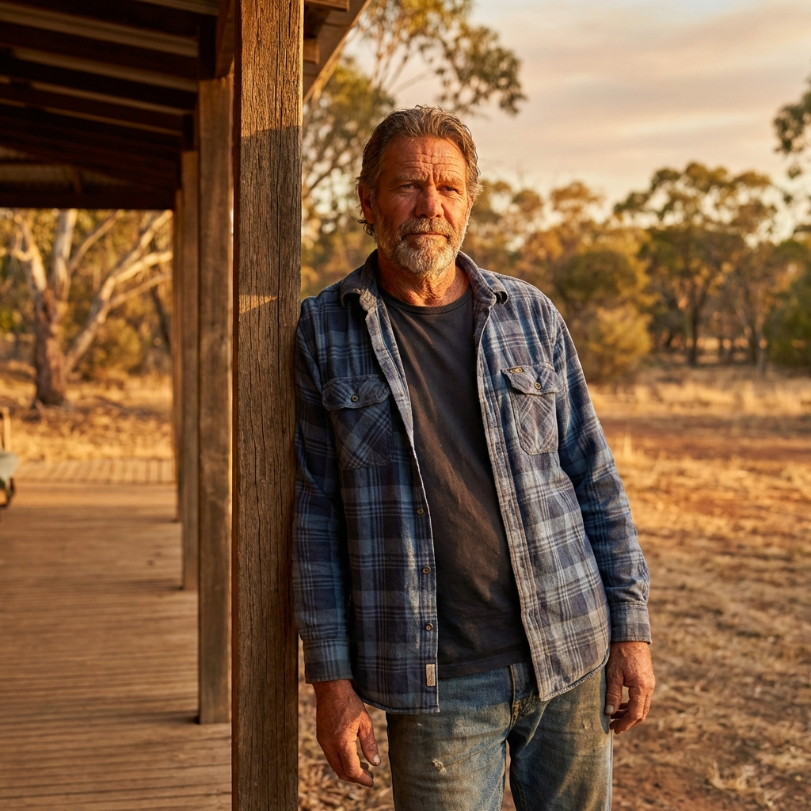

# The Archetype of the Ideal Australian: The Stoic Guardian

> **Core Philosophy:** "The world is hard, so we must be soft with each other."
> **Vector Coordinates:** Morality $\upsilon = +0.9$ (Universal Good), Will $\psi = +0.8$ (Resilient Action).

This document defines the **Ideal Australian Archetype**, synthesized from the 343 positive vectors of the National Kanon. Represents the aspiration of the culture—the "Best Self" that every Australian narrative points towards.

## 1. The Core Persona: The Stoic Guardian

The Ideal Australian is not a conqueror (Imperial) or a revolutionary (Radical), but a **Guardian**. They are defined by a specific tensile strength—the ability to endure the "Terror" of the land without losing the "Humanity" of the soul.

*   **The Bond:** They view society horizontally. No one is above them (Prince), no one is below them (Pauper).
*   **The Act:** They do not wait for the state to save them; they pick up a hose (The Volunteer).
*   **The Speech:** They speak rarely, and strictly the truth (The Pub Test). Irony is their shield against arrogance.

## 2. The 7 Pillars of the Ideal (The Unified Kanon)

### I. Identity: The Egalitarian (Who)
*   **Source:** Plane 1 (Identity) & Plane 4 (Drive).
*   **The Trait:** **Radical Horizontality**.

**The Narrative of the Equal Souled:**
The Egalitarian does not believe in the destruction of hierarchy for chaos's sake, but for dignity's sake. They possess an innate, almost biological inability to be impressed by status. When the Prime Minister walks into the public bar, the Egalitarian does not bow, nor do they sneer; they simply nod and ask, "What are you having?" This is not disrespect; it is the highest form of respect. It asserts that underneath the title, there is a human being who must be judged solely on their current conduct.
This trait prevents the rise of autocrats and the decay of the class system. It is the "Leveler" that Russal Ward identified—the mechanism that forces the "Master" to acknowledge the "Man" as a mate. It explains why Australians trust the "Quiet Australian" over the loud visionary. The Ideal Agent knows that "Jack is as good as his master" not because it is written in a constitution, but because when the fire comes, both burn at the same temperature.

**The Shadow Integration (Tall Poppy -> Humble Excellence):**
The shadow of this virtue is the "Tall Poppy Syndrome"—the vicious need to cut down anyone who excels. The Ideal Agent transmutes this envy into "Humble Excellence." They are allowed to be great—to win the Nobel Prize, to captain the team, to build the fortune—but the price of admission is humility. They must never *act* superior. They must ascribe their success to "Luck" (even if it was hard work) and "The Team" (even if it was solo genius). By determining to remain "one of us" despite their elevation, they disarm the envy of the collective.

**The Practical Application:**
In daily life, the Egalitarian is the one who insists on paying their round at the pub, regardless of income. They are the CEO who eats lunch in the staff canteen, not the executive dining room. They are the surgeon who introduces themselves by first name. This practice is not performance—it is instinct. The Egalitarian genuinely believes that the cleaner's opinion on the state of the world is as valid as the economist's, and they will sit and hear it. This creates a society where the "Quiet Australian" is trusted over the charismatic leader, where the "bloke next door" has more credibility than the celebrity, and where the greatest compliment you can receive is "not a bad sort."

### II. Definition: The Constituent (What)
*   **Source:** Plane 2 (Definition) & Plane 5 (Method).
*   **The Trait:** **Skeptical Civil Duty**.

**The Narrative of the Owners:**
The Constituent understands a truth that many other democracies forget: the State is a service provider, not a parent. They participate in the "Nanny State" not out of weakness, but out of a pragmatic contract. We agree to wear the seatbelt, to vote on the Saturday, to pay the tax, because we understand it buys us **Civilization**.
This archetype is the "Compelled Voter" who actually takes the time to number the boxes below the line. They view the "Democracy Sausage" not as a joke, but as a sacrament of the peace. They do not riot; they organise. When the "Faceless Men" of the party try to bypass the will of the people, the Constituent is the one who stands up at the Town Hall meeting and asks the simple, devastating question that unravels the spin. They are the immune system of the body politic, constantly checking for the virus of corruption or authoritarianism.

**The Shadow Integration (Apathy -> Vigilance):**
The shadow is "She'll be right"—the apathy that lets the system decay because "it's not my job." The Ideal Agent transmutes this into Vigilance. They know that "She'll be right" only if *someone* makes it right. They realise that the "Quiet Life" they crave is maintained only by the noise of accountability. They do not assume the system works; they test it.

**The Practical Application:**
The Constituent is the one who actually reads the fine print on the Council development application and shows up to object. They are the union delegate who keeps the minutes and knows the EBA by heart. They are the volunteer scrutineer on election night. They understand that the "Australian Settlement"—the implicit contract of wages, welfare, and a fair go—is not self-sustaining; it requires active citizenship to maintain. They take the "Nanny State" services gratefully but never forget that they are the *owners* of the utility, not the customers. When the politician says "trust me," the Constituent replies, "Show me the numbers."

### III. Land: The Steward (Where)
*   **Source:** Plane 3 (Land) & Plane 6 (Foundation).
*   **The Trait:** **Ecological Humility**.

**The Narrative of the Listener:**
The Steward has ceased fighting the continent. They have accepted the "Weird Melancholy" that Marcus Clarke described, but they no longer fear it. They see the "Sunburnt Country" not as a defect, but as a reality to be aligned with.
Whether they are a farmer in the Murray-Darling or a ranger in Kakadu, the Steward listens to the "Red Heart." They understand that water is more precious than gold. They do not impose European symmetry on an asymmetrical land. They adopt the deep-time perspective of the Indigenous Elders—they are not owning the land; they are "holding" it. They are the ones replanting the saltbush, culling the feral cat, and managing the fuel load before the summer which they know is coming. They are the first Australian archetype to truly be *of* the land, rather than just *on* it.

**The Shadow Integration (The Terror -> Respect):**
The shadow is the "Terror" of the Void—the fear of the empty spaces that drives us to huddle on the coast. The Ideal Agent transmutes this into Respect. They venture into the interior not to conquer, but to connect. They find beauty in the desolation, silence in the noise, and spiritual grounding in the dust.

**The Practical Application:**
The Steward checks the water tank before checking the stock market. They plant native species in their suburban garden. They know that the drought is not an aberration but a norm, and they plan accordingly. In politics, the Steward supports the Murray-Darling Basin Plan even when it hurts their local irrigator, because they understand the river is a system, not a resource. They are the ones pushing for Indigenous fire management to be adopted by the national parks. They have finally accepted that the European fantasy of "taming the land" is a colonial delusion; the only path to survival is listening to the land and the people who have lived with it for 65,000 years.

### IV. Drive: The Volunteer (Why)
*   **Source:** Plane 4 (Drive).
*   **The Trait:** **Silent Agency**.

**The Narrative of the First Responder:**
The Volunteer is the most sacred of all Australian archetypes. In a secular nation, the SES Orange, the Surf Life Saving Red and Yellow, and the RFS Yellow are the vestments of the priesthood.
The Ideal Agent acts without being ordered. When the floodwaters rise in Lismore, they launch their "Tinny" and start pulling neighbours off roofs. They do not ask for payment; in fact, offering it would offend them. They are driven by the "Bond" of Mateship—the knowledge that "we are all in this together." This drive is not ideological; it is purely practical. The job needs doing, the government is too far away, so I will do it.
This archetype represents the shift from the "Convict" (who works only under the lash) to the "Volunteer" (who works for the love of the tribe). It is the ultimate expression of free will in service of the Other.

**The Shadow Integration (Bludging -> Service):**
The shadow is the "Bludger"—the one who leans on the shovel while others dig. The Ideal Agent transmutes this lazy energy into Service. They realize that in a harsh environment, the Bludger endangers the whole pack. By leading by example, by sweating the most, they shame the Bludger into action. They make "Hard Yakka" a badge of honour, not a sentence.

**The Practical Application:**
The Volunteer is the backbone of the nation's disaster response. They are the reason Australia has one of the lowest fire-death-per-hectare ratios in the world. They are the reason stranded swimmers are pulled from the rips. They are the reason sandbagged levees hold. The Volunteer does not wait for the government contract or the insurance claim; they act because the community *is* the insurance. In return, the community offers them its highest honour: not a medal, but a cold beer and a handshake. The Volunteer understands that "Mateship" is not a slogan—it is a mutual defence pact, enacted in muscle and time.

### V. Method: The Improviser (How)
*   **Source:** Plane 5 (Method).
*   **The Trait:** **Pragmatic Genius**.

**The Narrative of the Bricoleur:**
The Improviser is the genius of the "Good Enough." They do not need a manual; they need a piece of wire, a pair of pliers, and ten minutes. They are the masters of the "bodge"—not in the sense of shoddy work, but in the sense of ingenious adaptation.
Why wait three weeks for the part from America when you can machine it out of an old axle? The Improviser sees objects not as fixed entities, but as sets of possibilities. They are the spiritual descendants of the Bush Mechanic and the colonial inventors of the Stump Jump Plough. They value "Utility" above "Aesthetics."
In the boardroom or the laboratory, this trait manifests as "Blue Sky Research" (like WiFi). They look at a signal meant for black holes and realise it can be used to network computers. They connect dots that the specialist misses because they are looking at the whole messy system.

**The Shadow Integration (The Shortcut -> Innovation):**
The shadow is the dangerous "Shortcut"—cutting corners on safety to get to the pub earlier. The Ideal Agent transmutes this into Innovation. They distinguish between "Safety Red Tape" (which saves lives) and "Bureaucratic Red Tape" (which wastes time). They cut the latter ruthlessly but respect the former religiously. They find the most efficient path, not the laziest one.

**The Practical Application:**
The Improviser is the reason Australia punches above its weight in science and technology. From WiFi to the cochlear implant to polymer banknotes, Australian inventions are characterized by elegant simplicity—a solution that works with what's available. The Improviser does not wait for perfect conditions; they prototype today. They are the farmer who rigs the solar pump, the tradie who fabricates the part, the researcher who repurposes the telescope signal. They trust experience over credentials and "having a crack" over endless planning. The Improviser's mantra is: "She'll do."—not as apathy, but as pragmatic confidence in the rough solution that *actually works*.

### VI. Foundation: The Reconciler (Cause)
*   **Source:** Plane 6 (Foundation) & Plane 7 (Result).
*   **The Trait:** **Historical Courage**.

**The Narrative of the Truth-Teller:**
The Reconciler is the rarest and most necessary version of the Ideal. They are the one who has the courage to sit in the uncomfortable silence of the past. They acknowledge the "Original Sin" of dispossession not with guilt (which is passive and useless) but with responsibility (which is active and healing).
They are the Local Councillor who begins the meeting with an Acknowledgment of Country that is felt, not read. They are the Historian who refuses to redact the massacre from the town plaque. They are the Patriot who loves Australia enough to want it to be whole. They understand that the "Great Silence" is a rot in the foundation, and that the only way to fix the house is to underpin it with Truth.
They seek the synthesis of the "Ancient Raft" (Indigenous Heritage) and the "Tall Ship" (British Institutions) into a new, stronger vessel.

**The Shadow Integration (The Great Silence -> Truth-Telling):**
The shadow is "The Great Silence"—the collective agreement to look away from the blood in the soil. The Ideal Agent transmutes this into Truth-Telling. They know that a wound exposed to the air creates a scar, but a wound hidden festers. They choose the scar. They choose the pain of healing over the comfort of denial.

**The Practical Application:**
The Reconciler is the one who teaches their children that "Settlement" was also "Invasion"—and holds both truths without flinching. They are the school principal who invites the local Elder to speak at assembly, not as a novelty but as an authority. They are the journalist who writes the story of the massacre that the local council tried to bury. They understand that patriotism requires honesty: to love Australia is to want it to be whole, and it cannot be whole while pretending the wound does not exist. The Reconciler is not motivated by guilt—which is passive and often performative—but by the active desire to build something new on a foundation of truth.

### VII. Result: The Good Neighbour (Effect)
*   **Source:** Plane 7 (Result).
*   **The Trait:** **Regional Stability**.

**The Narrative of the Pacific Partner:**
The Good Neighbour has finally looked at the map. They have realized that they are not a displaced piece of Europe, but a major power in the Indo-Pacific. They define their security not by "walls" (stopping the boats) but by "bridges" (building the region).
They are the Australian who speaks Bahasa or Mandarin, not just English. They are the aid worker in the Solomons who listens before they build. They are the diplomat who uses "Middle Power" status to broker peace between giants. They project the "Fair Go" onto the international stage, arguing for a rules-based order where the "Small Nation" is as safe as the "Great Power."
They are the final result of the experiment: a confident, independent agent who is at home in their neighbourhood, secure in their history, and optimistic about their future.

**The Shadow Integration (Isolation -> Connection):**
The shadow is "Isolation"—the fortress mentality that sees the world as a threat. The Ideal Agent transmutes this into Connection. They replace the "Moat" with the "Trade Route." They realize that in a globalised world, there is no such thing as "Far Away." We are all neighbors now.

**The Practical Application:**
The Good Neighbour understands that Australian security is best served not by gunboats but by schools in Timor-Leste, medical clinics in Papua New Guinea, and disaster relief in Fiji. They are the advocate for the Pacific Islands Forum, the supporter of the seasonal worker visa, the proponent of treating the Indo-Pacific as a community rather than a chessboard. They know that when the cyclone hits Vanuatu, Australia's response is not charity—it is the behaviour of a neighbour. The Good Neighbour has moved beyond the "White Australia" mentality and the "Fortress Australia" anxiety to embrace a role as a confident, generous regional partner. They are the final proof that the Australian experiment worked: a nation secure enough in its identity to help build the identities of others.

## 3. The Narrative of the Ideal

> The **Ideal Australian** stands on the Verandah of a continent they finally understand. They are **The Steward** of the land, managing the fire and the flood with the wisdom of deep time. Bound by the **Egalitarian** code, they judge a person only by their willingness to have a go. When the crisis comes, they become **The Volunteer**, stepping forward not for glory, but because it needs doing. They solve problems as **The Improviser**, fixing the unfixable with pragmatic wit. They have found the courage of **The Reconciler**, healing the ancient wound of the nation through truth. Ultimately, they are **The Good Neighbour**, secure in their own skin, offering a **Fair Go** to the world.
