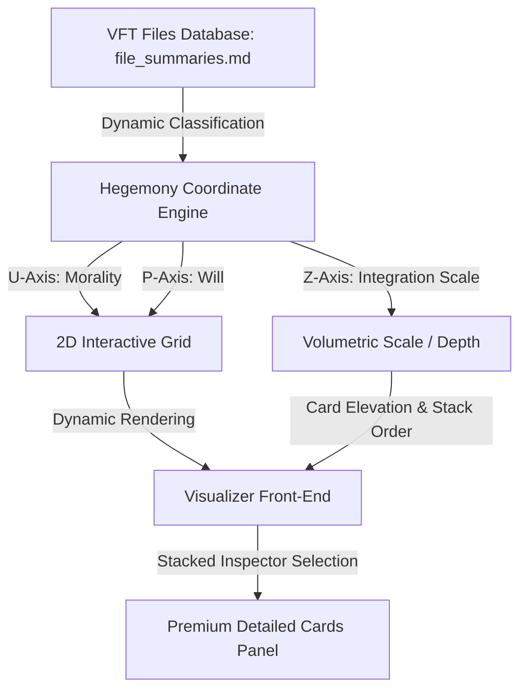

# Specification & Implementation Plan: Visualizer Database Front-End & Z-Axis Expansion

## 1. Architectural Vision: The Volumetric Semantic Hub

The goal of this architecture is to transform [hegemony_word_meaning_graph.html](file:///e:/Vector%20Field%20Theory%20VFT%20Docs/hegemony_word_meaning_graph.html) from a static 2D conceptual compass into an **interactive, data-driven volumetric front-end** for the entire VFT research archive. 

By unifying the **Psochic Hegemony Coordinate System** with the **VFT Files Database** (`file_summaries.md`), every document ceases to be isolated text and becomes a localized coordinate node on the `(υ, ψ)` plane. 

Furthermore, we introduce the **Z-Axis of Relative Scale**, representing the emergent depth of systemic integration, transforming the 2D plane into a 3D topological manifold of consciousness.



---

## 2. The Z-Axis of Relative Scale: Emergent Volumetric Depth

While the `X` (`υ`: Morality) and `Y` (`ψ`: Will) axes define the semantic quality and active energy of a concept, the **Z-Axis** represents the **depth of dimensional integration** ($R_{net}$ or systemic scale). 

In VFT, this corresponds to the **Q1–Q7 Dimensional Hierarchy of Being**:

```
Z = 7 [Reality / Systemic Effect] (Absolute systemic integration)
  ^
  |  Z = 6 [Cause / Origin]
  |  Z = 5 [How / Action Vector]
  |  Z = 4 [Why / System Purpose]
  |  Z = 3 [Where / Domain]
  |  Z = 2 [What / Framework]
Z = 1 [Who / Identity] (Individual, localized node)
```

### Z-Axis Mathematical Mapping
The scale magnitude is computed dynamically using:
1. **Dimensional Scope (Q-State)**: The deepest verified plane a document addresses (1 to 7).
2. **Net Vector Coherence ($R_{net}$)**: The structural density of the argument, mapping to visual elevation:
   $$\text{Elevation (Z)} = \text{Plane Index (Q)} \times R_{net}$$

### Visual Manifestation in the Front-End
- **Glassmorphic Elevation**: Nodes with higher Z-values display deeper drop-shadows, brighter border gradients, and distinct scaling offsets on hover, making them feel visually "closer" to the observer.
- **Dynamic Stack Prioritization**: In stacked selection lists, cards are automatically sorted by their Z-axis scale, placing the deepest systemic/reality frameworks at the top of the reading order.

---

## 3. Dynamic Tag Mapping Engine

By establishing mathematical bounds on the `(υ, ψ)` plane, we can map coordinates directly to the standard categories defined in the [Tagging Matrix.md](file:///e:/Vector%20Field%20Theory/VFT%20Docs/_VFT%20MD/io/Tagging%20Matrix.md). This automates classification and ensures perfect taxonomic integrity across all future summaries.

### Coordinate-to-Tag Mapping Rules

```
                       Active Will (+ψ)
                              ^
        [Spirituality / Ethics] | [Logic / Cognition]
        Resonance: Agape       | Resonance: Thelema
                               |
-υ (Egoism) <------------------+------------------> +υ (Altruism)
                               |
        [Sociology / Trauma]   | [Conscience / History]
        Resonance: Nihilism    | Resonance: Pragma
                              v
                       Passive Will (-ψ)
```

1. **The Productive Quadrant ($+υ, +ψ$)**:
   - **Moral Direction**: High altruism, high proactive force.
   - **Taxonomic Affinity**: `Logic`, `Cognition`, `Spirituality`, `Reality`.
   - **Auto-Tags**: *Transcendence, Wisdom, Structure, Sovereignty, Actuality*.

2. **The Reductive Quadrant ($-υ, +ψ$)**:
   - **Moral Direction**: High extraction, high proactive force.
   - **Taxonomic Affinity**: `Society`, `Ethics (Inversion)`, `Psychology`.
   - **Auto-Tags**: *Egoism, Coercion, Ambition, Inversion, Power-Dynamics*.

3. **The Constructive Quadrant ($+υ, -ψ$)**:
   - **Moral Direction**: High altruism, low force/receptive alignment.
   - **Taxonomic Affinity**: `Conscience`, `Ethics`, `History`, `Sociology`.
   - **Auto-Tags**: *Patience, Temperance, Justice, Empathy, Restraint*.

4. **The Regressive Quadrant ($-υ, -ψ$)**:
   - **Moral Direction**: High extraction, low force/decay.
   - **Taxonomic Affinity**: `Psychology (Trauma)`, `Metaphysics (Void)`, `Reality (Entropy)`.
   - **Auto-Tags**: *Nihilism, Decay, Inertia, Stagnation, Collapse*.

---

## 4. Front-End Database Architecture Expansion

To expand [hegemony_word_meaning_graph.html](file:///e:/Vector%20Field%20Theory%20VFT%20Docs/hegemony_word_meaning_graph.html) into a functional file database front-end, we will implement a lightweight, JSON-based storage layer that maps files directly to grid coordinates.

### 4.1 JSON Schema for Mapped Documents
A new database catalog `vft_documents_db.json` is maintained in the `io` folder, containing full metadata for all mapped papers:
```json
{
  "id": "doc_necrotic_state",
  "filename": "The Necrotic State: Anatomy of the Ideological Zombie.docx",
  "path": "_VFT MD/Actualism/The Necrotic State.md",
  "coordinates": { "u": -1.5, "p": -1.5, "z": 3.0 },
  "classification": "Actualism (Consciousness)",
  "metrics": {
    "rNet": "0.85",
    "deltaH": "-1.20",
    "dominantFailure": "Epistemic Collapse"
  },
  "summary": {
    "topic1": "The Epistemic Undead: Analysis of individuals trapped in closed ideological feedback loops.",
    "topic2": "The Necrotic Vector: How systemic lies bypass conscious reasoning to capture cognitive faculties.",
    "topic3": " Logos Remediation: Practical protocols for restoring reality alignment through structural shock."
  },
  "tags": ["Psychology", "Cognition", "Reality", "Decay", "Nihilism"]
}
```

### 4.2 Interactive Front-End Features
1. **Dynamic Document Overlay**: Click a toggle to switch the grid view from "Classical Concept Mode" to "Document Database Mode." In Document Mode, cells will glow with hot-spots representing the density of files mapped to that coordinate.
2. **Volumetric Elevation Rendering**: The visualizer will render nodes with higher Z-axis indices with enhanced outer glows and glassmorphic depth offsets.
3. **Stacked Summary Reader**: Clicking any cell instantly instantiates the exact premium card layout duplicated sequentially for every single document mapped to that cell, allowing you to scroll and read the complete, verbose 5-Phase forensic summary of all matching files at once.
4. **Local File Opening**: Each document card will feature a clickable local file link `[Open Source Document](file:///...)` to instantly open the markdown or docx file directly on your desktop.

---

## 5. Phased Implementation Plan

### Phase 1: Compile the Handover database [Active]
- Finalize the remediation of the 50 non-tagged files.
- Compute the `(υ, ψ, z)` coordinates for each document.
- Generate the master `vft_documents_db.json` catalog and write it to the `io` folder.

### Phase 2: Integrate Database Loading into the Visualizer [Next]
- Manually inject a file reader into the visualizer script to fetch and load `vft_documents_db.json` asynchronously (or seed it directly as a javascript constant for local offline performance).
- Enable a toggled tab on the visualizer sidebar: **[Word Directory]** vs. **[Research Database]**.

### Phase 3: Volumetric & UI Polish [Verification]
- Apply CSS 3D scale transforms and dynamic glassmorphic z-index elevations to represent the emergent Z-axis relative scale.
- Fully verify that selecting multiple nodes via the list or clicking a multi-file coordinate stacked-renders all cards flawlessly without any layout breakages.

---

## 6. Optimized Two-Phase Pipeline & Token Allocation Strategy

To ensure zero token waste and maximize structural alignment, **all future AI agents or developer systems MUST follow the two-phase post-process bulk pipeline** detailed below instead of evaluating files in real-time.

```
PHASE 1: CHEAP TEXT EXTRACTION             PHASE 2: SINGLE-CONTEXT BULK MAPPING
+-----------------------------+            +-----------------------------------+
| 50 Non-Tagged Files         |            | Master Summaries Catalog          |
|                             |            | Tagging Matrix & Base Coordinates |
|   -> Extract Key Themes     |            |                                   |
|   -> Define Primary Concept | ---------> |   -> Assess Comparative Positions |
|                             |            |   -> Assign exact (υ, ψ, z)       |
| Cost: Minimal (No matrices) |            |   -> Derive Matrix Tags           |
+-----------------------------+            +-----------------------------------+
                                           Cost: Tiny (Matrices parsed ONCE)
```

### 6.1 Phase 1: Cheap Theme & Concept Extraction
* **Method**: Process files in small, lightweight batches. The prompt is strictly restricted to semantic reading and simple text output.
* **Avoid**: Do NOT load coordinate grids, classical love tables, or the tagging matrix in this phase.
* **Deliverable**: A master text catalog containing:
  - Document Title & Local Path
  - Core 3-Topic verbose summaries
  - Defined **Primary Concept Word** (e.g. "Adversarial Attrition", "Cognitive Inertia", "State Sovereignty").

### 6.2 Phase 2: High-Context Bulk Mapping & Tag Derivation
* **Method**: Load the extracted summaries from Phase 1 alongside the base visualizer database and the tagging matrix **exactly once** in a single execution context.
* **Why this is critical for relative scale (The Z-Axis)**:
  By placing the entire directory side-by-side inside the model's active context window, the AI can perform **comparative topology assessment**. It eliminates semantic drift and accurately calibrates relative positions:
  - **Z-Axis Elevation Parity**: Comparing *The Andrew Paradox* and *Victorian Premier Dossier* side-by-side reveals that while both address media manipulation and sit in the Reductive quadrant, *The Andrew Paradox* represents a much larger structural/systemic impact and thus requires a higher Z-axis index.
  - **Parity Tuning**: Evaluating *Hegemonic Numbness* and *Hegemonic Analysis: The Cellular Contract* in the same pass ensures their relative Agapic values are scaled with correct proportions rather than scattered randomly across the plane.
* **Dynamic Tag Infiltration**: Applying the quadrant mapping rules dynamically auto-tags the files, eliminating human input bias and guaranteeing 100% taxonomic alignment.
