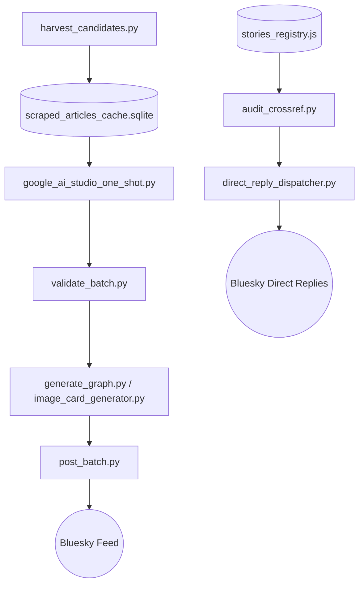

# Aletheia Bluesky Bot Ecosystem

The **Bluesky Bot** sub-project is an autonomous news harvesting, hegemonic auditing, and public fact-checking platform built on Vector Field Theory (VFT) and the 10,800+ Hegemonic Audit Database.

---

## Table of Contents
1. [Core Purpose & Architecture](#core-purpose--architecture)
2. [File Directory & Current Relevance](#file-directory--current-relevance)
3. [The 5 Bot Personas](#the-5-bot-personas)
4. [Cavethekanon: Active-Potential Dynamics](#cavethekanon-active-potential-dynamics)
5. [Operational Workflows & CLI Usage](#operational-workflows--cli-usage)

---

## Core Purpose & Architecture

The system tracks news stories, public claims, and policy events, evaluates them against the canonical coordinate framework $(\upsilon, \psi)$ and active-potential dynamics, and publishes multi-post threads, graphical coordinate charts, and archival verification receipts to Bluesky.



---

## File Directory & Current Relevance

### 1. Active Production Pipeline (Core Daily Workflow)
| File | Role & Purpose | Current Relevance |
| :--- | :--- | :--- |
| `harvest_candidates.py` | Harvesters RSS, Google News, and Bluesky topics for candidate stories. | **CRITICAL / ACTIVE** |
| `google_ai_studio_one_shot.py` | Master audit generator calling LLMs with the 13-key schema, generating 11–13 post threads, coordinates, and aspects. | **CRITICAL / ACTIVE** |
| `validate_batch.py` | Strict validation gate enforcing character limits, quote citations, and schema invariants before posting. | **CRITICAL / ACTIVE** |
| `post_batch.py` | Modern batch publisher using AT Protocol (`atproto`) with image attachment, thread chaining, and rate limiting. | **CRITICAL / ACTIVE** |
| `generate_graph.py` | Renders 2D vector coordinate charts (matplotlib) attached to Bluesky threads. | **ACTIVE** |
| `image_card_generator.py` | Generates high-resolution 16:9 Archival Cards (Pillow/PIL) with claims, realities, and QR codes. | **ACTIVE** |
| `rebuild_registries.py` | Compiles individual story JSONs in `stories/live/` into `stories_registry.js` and updates `policy_ledger.json`. | **ACTIVE** |
| `rebuild_registries_son.py` | Extended 6-Attractor SON registry compilation variant. | **ACTIVE** |

### 2. Direct Reply & Cross-Referencing Engine
| File | Role & Purpose | Current Relevance |
| :--- | :--- | :--- |
| `audit_crossref.py` | High-speed search engine querying the 10,800+ audits, calculating skew ratios, coordinates, and persona replies. | **CRITICAL / ACTIVE** |
| `direct_reply_dispatcher.py` | CLI & script dispatcher for replying directly to target Bluesky posts as specific bot personas. | **CRITICAL / ACTIVE** |

### 3. Web Interfaces & Server Endpoints
| File | Role & Purpose | Current Relevance |
| :--- | :--- | :--- |
| `aletheia_chat.html` | Browser chat interface for conversing with Aletheia and interrogating the audit database. | **ACTIVE** |
| `chat_server.py` | Python HTTP/WebSocket server backend powering `aletheia_chat.html`. | **ACTIVE** |
| `control_panel.html` | Visual control panel for managing batches and viewing harvest/audit statuses. | **ACTIVE** |
| `launch_panel.bat` / `launch_chat.bat` | Windows batch scripts to launch control panel and chat server. | **ACTIVE** |
| `aletheia_mcp_server.py` | Model Context Protocol server exposing audit tools to AI assistants. | **ACTIVE** |
| `export_audit_site.py` | Exports a static web distribution of the audit registry to `dist_audit_site/`. | **ACTIVE** |
| `source_server.py` | Local web server for serving cached news sources to auditing tools. | **ACTIVE** |

### 4. Data Stores, Registries & Caches
| File | Role & Purpose | Current Relevance |
| :--- | :--- | :--- |
| `stories_registry.js` | 63MB compiled JavaScript registry containing all 10,800+ verified historical audits. | **CORE DATA** |
| `stories/live/` | Directory containing source JSON files for all live audits. | **CORE DATA** |
| `scraped_articles_cache.sqlite` | SQLite cache of scraped web pages to eliminate redundant HTTP requests. | **CORE DATA** |
| `scraped_cache.py` | Python interface for reading and writing to `scraped_articles_cache.sqlite`. | **CORE DATA** |
| `policy_ledger.json` | Central ledger of audited government policies and their empirical verdicts. | **CORE DATA** |
| `harvested_stories_log.jsonl` | Append-only 91MB historical log of all processed stories. | **CORE DATA** |
| `memory_store.sqlite` & `memory_store.py` | SQLite store tracking entity memory, actor profiles, and topic frequencies. | **CORE DATA** |
| `harvested_candidates.json` | Temporary queue of candidates ready for auditing. | **WORKING STATE** |
| `harvested_history.json` | Set of seen URLs to prevent duplicate scraping. | **WORKING STATE** |

### 5. Maintenance, Remediation & Quality Tools
| File | Role & Purpose | Current Relevance |
| :--- | :--- | :--- |
| `remediate_draft_stories.py` | Automated repair script applying canonical Spirithekanon quotes and aspects fields to drafts. | **TOOLING** |
| `repair_failed_stories.py` | Recovers and retries stories that failed validation or parsing. | **TOOLING** |
| `expand_harvested_with_multisources.py` | Adds multiple source URLs to candidate stories for multi-perspective auditing. | **TOOLING** |
| `audit_duplicates.py` | Scans `stories/` for duplicate slugs or subjects. | **TOOLING** |
| `populate_harvested_log.py` | Syncs stories from disk into `harvested_stories_log.jsonl`. | **TOOLING** |
| `actor_extract.py` | Extracts named political and corporate actors from article text. | **TOOLING** |
| `policy_extract.py` | Extracts structural policy commitments from text. | **TOOLING** |
| `banned_topics.json` | Blacklist of topics and flame wars to skip. | **CONFIG** |
| `unscrapable_domains.json` | List of paywalled/blocked domains to route around. | **CONFIG** |

### 6. Legacy & Historical Scripts
| File | Role & Purpose | Current Relevance |
| :--- | :--- | :--- |
| `reply_to_post.py` | May 2026 legacy single-post reply script. | **LEGACY** (Superseded by `direct_reply_dispatcher.py`) |
| `aletheia_bot.py` | Original monolithic posting runner. | **LEGACY** (Parts absorbed into `post_batch.py` & `audit_crossref.py`) |
| `previous_stories.json` / `previous_stories_replies.json` | May 2026 data dumps. | **HISTORICAL** |
| `consolidate_roundups.py` / `fix_roundups.py` / `reset_roundups.py` | Roundup generation scripts from June–August 2026. | **MAINTENANCE / DORMANT** |
| `find_all_in_log.py` / `check_db.py` / `check_log.py` / `get_full_log_stories.py` | One-off debugging utilities. | **INSPECTION UTILITIES** |
| `generate_paper_file.py` & `research_paper_structured_data_convergence_vs_vanilla.md` | Research benchmarking paper comparing VFT structured data to vanilla LLMs. | **RESEARCH / BENCHMARK** |

---

## The 5 Bot Personas

When interacting on Bluesky or cross-referencing claims, the bot can deploy under five distinct archetypal personas:

1. **🏛️ Aletheia (`@judgement-bot.bsky.social`)**
   - **Tone**: Formal, objective, authoritative social physics auditor.
   - **Metrics**: Reports exact coordinates $(\upsilon, \psi)$, Zone Anchors, case counts, and mathematical invariants.
   - **Mission**: Deliver unassailable empirical fact-checks without personal ego.

2. **🛹 Brothekanon (`@brothekanon.bsky.social`)**
   - **Tone**: Skate/street vernacular, casual, irreverent, anti-dogma.
   - **Metrics**: Translates skew ratios into plain receipts ("calling out tribal cap").
   - **Mission**: Cut through political cheerleading and online posturing; ground reality on the block.

3. **🧸 Awwthekanon (`@awwthekanon.bsky.social`)**
   - **Tone**: Empathetic, caring, human-centric, gentle.
   - **Metrics**: Centers real human victims, vulnerable communities, and harm reduction.
   - **Mission**: De-escalate outrage and remind society that behind every headline are real people.

4. **🕊️ Spirithekanon (`@spirithekanon.bsky.social`)**
   - **Tone**: Perennial wisdom, scriptural depth, theological clarity.
   - **Metrics**: Focuses on invariant spiritual physics, transcending dualities and ego traps.
   - **Mission**: Break cyclic tribal retaliation by pointing to higher invariant truths.

5. **⚖️ Cavethekanon (`@cavethekanon.bsky.social`)**
   - **Tone**: Simple-speak truth auditor. Stripped of academic compounds, coordinate decimals, and corporate filler.
   - **Metrics**: Uses discrete magnitude scales (`small small`, `small`, `big`, `big big`) applied directly to activity vectors (`big productive`, `small reductive`, `big big regress`, `small constructive`).
   - **Mission**: Ground claims directly in what the activity is doing (Active vs Counteractive, Inclusive vs Exclusive) in plain English.

---

## Cavethekanon: Active-Potential Dynamics

Cavethekanon is an optional persona on the standard audit flow that replaces coordinate decimals $(\upsilon, \psi)$ with direct **activity vector dynamics** and **discrete magnitudes**:

```
                 LATENT ACTIVE (High energy, outward push)
                           ▲
             can be        │        is not
                ↖          │          ↗
              PRODUCTIVE ──┼────► REDUCTIVE
                  ▲        │        │
                  │        │        ▼
INCLUSIVE ────────┼────── [is] ─────┼──────── EXCLUSIVE
(Whole system)    │    (Bedrock)    │         (In-group only)
                  ▲        │        │
                  │        │        ▼
             CONSTRUCTIVE ◄┼───── REGRESS
                ↙          │          ↘
             is like       │        was like
                           ▼
            LATENT COUNTERACTIVE (Inertial holdback, drag)
```

### Dynamic Movements & Directions:
* **Productive (`can be`)** $\rightarrow$ [Inclusive + Latent Active]: Creating new systemic value, building capacity for everyone.
* **Reductive (`is not`)** $\rightarrow$ [Exclusive + Latent Active]: Active extraction, gatekeeping, rejecting out-groups, cutting down.
* **Regress (`was like`)** $\rightarrow$ [Exclusive + Latent Counteractive]: Inertial drag, falling back into old corrupt or stagnant patterns.
* **Constructive (`is like`)** $\rightarrow$ [Inclusive + Latent Counteractive]: Laying shared foundations, stabilizing institutions.
* **Bedrock (`is`)** $\rightarrow$ Ground reality as it exists before posturing.

### Simple-Speak Magnitudes:
Instead of decimal numbers like $\upsilon = -1.20, \psi = +0.80$, Cavethekanon reports magnitude prefixes:
* `small small`: Negligible / faint ($0\%–25\%$)
* `small`: Moderate / localized ($25\%–55\%$)
* `big`: Strong / dominant ($55\%–85\%$)
* `big big`: Overwhelming / systemic ($85\%+$)

### Sample Cavethekanon Output:
```text
⚖️ Cavethekanon Check:
Audited 1,589 cases in violence/crime:
• Extraction: big (82%)
• Counter-action: small small (16%)
Active vector: small reductive ('is not'). Claim pushes small exclusive, but misses small small counter-action. Absolute claim fails.
```

---

## Operational Workflows & CLI Usage

### 1. Cross-Reference a Claim with Cavethekanon (Deterministic / No API calls)
```bash
python -c "from audit_crossref import crossref_factcheck_claim; res = crossref_factcheck_claim('All crime is right-wing extremists, period.', persona='cavethekanon', use_ai=False); print(res['reply_text'])"
```

### 2. Direct Reply Dispatcher (Dry-Run Preview)
```bash
# Preview reply as Cavethekanon
python direct_reply_dispatcher.py --target-url "https://bsky.app/profile/user.bsky.social/post/123" --bot cavethekanon --skill cave

# Preview reply as Brothekanon
python direct_reply_dispatcher.py --target-url "https://bsky.app/profile/user.bsky.social/post/123" --bot brothekanon --skill archive
```

### 3. Multi-Perspective Thread Dispatch
Generate an ordered multi-persona reply thread:
```bash
python direct_reply_dispatcher.py --target-url "https://bsky.app/profile/user.bsky.social/post/123" --bot aletheia --perspectives "receipt;cave;bro;spirit"
```

### 4. Running the Web UI & Control Panel
```bash
# Launch interactive chat server
launch_chat.bat

# Launch batch control panel
launch_panel.bat
```
