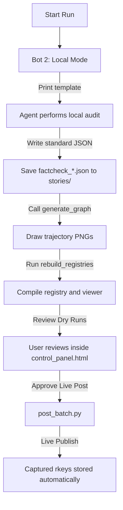

# Workflow: Aletheia Bot Batch Harvesting, Auditing, & Posting

This workflow governs the execution of the **Local Agent-Interactive Bot (Bot 2)**. 

> [!WARNING]
> ### BOT 1 (API-DRIVEN MODE) IS BANNED FROM WORKFLOW USAGE
> To protect your wallet and conserve your Google AI Studio token quota, **Bot 1 (automated background API evaluations via python scripts) is strictly banned** from active workspace workflows. Do not run or trigger background API evaluation pipelines during agent turns.

---

## 1. Core Structural Constraints & Rules

Every single factcheck config file must strictly adhere to these guidelines to prevent UI crashes and maintain conversational excellence:

### The Strict 13-Key Schema
Every story JSON file saved inside `stories/` or `stories/live/` must be a list containing a single dictionary: `[ { ... } ]`. It must contain **only** these allowed keys, in standard order:
1. `"subject"`: Brief 2–4 word title of the news story.
2. `"link"`: The actual external news article URL (e.g. `https://www.bbc.com/...`).
3. `"claim_u"`: Stated claim Morality decimal (`-2.0` to `+2.0`).
4. `"claim_psi"`: Stated claim Will decimal (`-2.0` to `+2.0`).
5. `"real_u"`: Actual ground-level Morality decimal (`-2.0` to `+2.0`).
6. `"real_psi"`: Actual ground-level Will decimal (`-2.0` to `+2.0`).
7. `"mode"`: `"reply"` or `"root"`.
8. `"target_url"`: The original user's Bluesky post URL we are replying to (only when `mode` is `"reply"`).
9. `"posts"`: A list of exactly 14 strings (the complete thread).
10. `"rkeys"`: (Optional) List of Bluesky post keys (added automatically when live).
11. `"post_urls"`: (Optional) List of posted thread URLs (added automatically when live).
12. `"status"`: `"COMPLETED DRY RUN"` or `"LIVE"`.
13. `"id"`: Clean string slug serving as the unique identifier.

* **DO NOT** include `subject_slug`, `verdict`, `graph_img`, or any other custom keys in individual JSON files. These are derived dynamically by the registry builder.

### The Thread Writing Style & Structure
* **No Numbering:** Do NOT prefix posts with `1/`, `2/`, `3/` or any indices. Every post must read as an organic, standalone conversational paragraph.
* **Punchy, Human Intros:** Post 1 (The Hook) must start with a custom, attention-grabbing, human-written one-liner that sets the scene. Never use generic headers like *"We're auditing..."* or *"Alethekanon Systemic Analysis..."*.
* **Character Bounds:** Keep every single post strictly under 250 characters to prevent accidental text splitting.

#### The Exact 14-Post Thread Sequence:
The thread list (`"posts"`) must consist of exactly 14 posts, structured precisely as follows:
1. **Post 1 (The Hook):** `[Punchy, human-written one-liner setting the scene]\n\nSubject: [Subject]\nSource: [External Article URL] (or Target Post: [External Article URL] if reply)\nEvidence Standards: [Standards]\n\nPsochic Hegemony Graph`
2. **Post 2 (The Claim):** `The Claim:\n[Paragraph explaining stated intent]\nStated Judgement: ([claim_u], [claim_psi]) — [Coordinate Label]`
3. **Post 3 (The Reality):** `The Reality:\n[Paragraph exposing ground-level reality]\nResulting Judgement: ([real_u], [real_psi]) — [Coordinate Label]`
4. **Post 4 (The Verdict):** `Verdict: [PASS/FAIL] — [Trajectory Path]. [Rich, 1–2 sentence Plain English explanation of the trajectory's structural cause and systemic outcome. Never print just the dry coordinate label; explain why it is happening.]`
5. **Post 5 (What's happening):** `What's happening: [Dedicated 1-paragraph explanation of the news event or the system's actions in plain English]`
6. **Post 6 (The Nuance):** Identify the nuance. Header must be `The Bright Side:\n[nuance]` (if story is negative) or `The Poison:\n[nuance]` (if story is positive).
7. **Post 7 (The Breakdown & Plane Error):** `The Breakdown & Plane Error:\n[Paragraph explaining Plane Error simply in plain language]`
8. **Post 8 (The Switch):** Expose the forensic test/bait-and-switch naturally in plain language (max 250 chars).
9. **Post 9 (The Trajectory):** `The Trajectory: Trajectory of [Trajectory]\nWhen you map the gap between stated intentions and ground-level results...`
10. **Post 10 (The Destination):** `...it plots a direct trajectory toward [Outcome/Terminal Zone]` followed by a brief 1-sentence mathematical explanation.
11. **Post 11 (The Unavoidables):** `The Unavoidable Truth: [truth text]\n\nThe Unavoidable Lie: [lie text]`
12. **Post 12 (Trinary Persona Reaction):** `[Awwthekanon or Brothekanon]:\n[Concise reaction in their unique voice, under 250 chars]`
13. **Post 13 (Aletheia's Synthesis):** `Aletheia's Synthesis:\n[Synthesized blended path, max 230 chars]`
14. **Post 14 (Resolution Vector):** `Synthesized Resolution Vector:\nBlended Path: [Blended path summary]\nFinal Recalculated Coordinates: ([real_u], [real_psi])`

---

## 2. Operational Pipelines



### Pipeline: Local Agent-Interactive Bot (Bot 2)
Designed to preserve your tokens/wallet. The AI agent performs evaluations in the workspace natively.

1. **Harvest Candidates:** Programmatically harvest de-duplicated candidates:
   ```bash
   .venv\Scripts\python.exe bluesky_bot/harvest_candidates.py --rss-target 0 --bsky-target 40
   ```
   * *This creates the raw candidate file at `scratch/harvested_candidates.json`.*

2. **Local Evaluation (Dry Run Generation):** Run the local orchestrator command:
   ```bash
   .venv\Scripts\python.exe bluesky_bot\orchestrate_batch_local.py
   ```
   * *This prints out the instruction templates. The Agent performs the Gnostic Convergence Tests, writes the standardized JSON files, and copies trajectory graphs.*
   * **STRICT RULE:** Every newly generated factcheck MUST be saved with `"status": "COMPLETED DRY RUN"` under `stories/`. **No live posting can occur at this stage.**

3. **Registry Compilation:** Compile and sync all registry databases to update the control panel:
   ```bash
   .venv\Scripts\python.exe scratch/rebuild_registries.py
   ```

4. **User Review (Safety Gate):**
   * Open [control_panel.html](file:///e:/Vector%20Field%20Theory/VFT%20Docs/bluesky_bot/control_panel.html) in your browser.
   * Review all 21 stories, verify their thread posts are unnumbered and intros are punchy, and check their Matplotlib trajectory graphs in the viewer.

5. **Live Posting:** When you are happy and approve the dry runs, execute the sequential publishing script:
   ```bash
   .venv\Scripts\python.exe bluesky_bot\post_batch.py
   ```
   * *This script reads the dry-run JSONs, posts them, and writes back `rkeys` and `post_urls` dynamically.*

---

## 3. Mandatory Verification Checklist

Before ending your turn or pushing changes, verify:
- [ ] Run `scratch/inspect_factchecks.py` (after restoring it from `_Archive/` temporarily if needed) to ensure **0 corrupted files** are on disk.
- [ ] Open `control_panel.html` and verify that the sidebar renders all stories without crashing.
- [ ] Ensure `stories_registry.js` is updated in both `bluesky_bot/` and `_Generated_Content/`.

