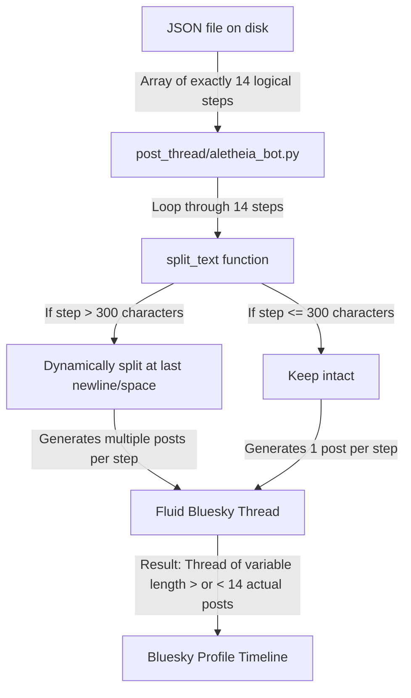

# Aletheia Bot Workspace File Audit & Structural Mutation Mapping

This document compiles a comprehensive, exhaustive structural audit of all non-script, helper, configuration, and documentation files in the `bluesky_bot/` root folder and its plan subdirectories. It details every historical mutation of the thread/post structure, corrects a persistent documentation error on disk, and establishes a single source of truth for the distinction between **logical evaluation steps** and **fluid published posts**.

---

## 1. Documentation & Intent Logs (Core Guidance Tier)

These Markdown (`.md`) files provide the conceptual backbone, operating constraints, and context safety gates for the system.

### [bluesky_bot_instructions.md](file:///e:/Vector%20Field%20Theory%20VFT%20Docs/bluesky_bot/bluesky_bot_instructions.md)
* **Purpose:** Core unified instruction manual, framework parameters, and thread formatting blueprint.
* **Key Contents:**
  * Technical definitions for the 5-Phase Convergence Test (Actualism Framework) including coordinate mapping rules (`+1,0` = Good Preference, `-1,0` = Bad Preference).
  * **Unified Prefix-Free Conversational 14-Step Format:** Directives for conversational Plain English thread flow, removing robotic titles, setting the exact `Stated Ideal v Actual vs Actual Ideal` evidence standards standard in Step 1, and establishing the exact steps-vs-posts mapping logic.
* **Mutation Audit:** Successfully recovered and consolidated. The outdated 11-step legacy sequence has been completely overwritten, and all duplicate/fragmented instruction files (e.g. `certain_format_blueprint.md`) have been deleted, establishing this as the single, absolute operational source of truth.

### [running_dialogue.md](file:///e:/Vector%20Field%20Theory%20VFT%20Docs/bluesky_bot/running_dialogue.md)
* **Purpose:** External project scope memory tracker and compaction safelock.
* **Key Contents:**
  * **Compaction Recovery Safelock Protocol:** A caution block directing newly resumed agents to halt immediately, avoid running scripts or modifying files, and wait for explicit user approval.
  * Chronological log of Intents (Intents 1 to 18) detailing development phases, bug remediation, coordinate corrections, and morality audits.
  * Formatting constraints (Plain English, explicit evidence standards, coordinate labels, and Hook formatting rules).
* **Mutation Audit:** Tracks active project modifications and serves as the primary safeguard against context-wipe regressions.

### [subagent_batch_plan.md](file:///e:/Vector%20Field%20Theory%20VFT%20Docs/bluesky_bot/subagent_batch_plan.md)
* **Purpose:** Mathematical token optimization plan for parallel batch runs.
* **Key Contents:**
  * Outlines the "Finder vs. Evaluator" division of labor.
  * Mathematical context footprint analysis proving that splitting $N=20$ stories into 4 concurrent batches of 5 saves 63% of input tokens (~400,000 tokens) compared to a monolithic evaluation loop by preventing quadratic history build-up.
* **Mutation Audit:** Lays out the concurrency logic that governs how evaluator workers are spawned.

---

## 2. Project Plans, Recoveries, & Walkthroughs (Historical Mutation Tier)

These Markdown documents inside `_AI_Project_Plans/` track the development cycles, structural mutations, and cleanup phases of the bot.

### [_AI_Project_Plans/aletheia-bot-batch.md](file:///e:/Vector%20Field%20Theory%20VFT%20Docs/bluesky_bot/_AI_Project_Plans/aletheia-bot-batch.md)
* **Purpose:** Workflow guidelines for the Local Agent-Interactive Bot (Bot 2).
* **Key Contents:**
  * Strict 13-key JSON schema and formatting constraints (no post numbering, punchy intros).
  * **The 14-Step Sequence Template:** Details the 14 logical evaluation steps (Hook, Claim, Reality, Verdict, What's happening, Nuance, Breakdown, The Switch, Trajectory, Destination, Unavoidables, Trinary Reaction, Synthesis, Resolution Vector).
  * Operational pipelines diagram and verification checklist.
* **Mutation Audit:** This document introduces the persistent naming mistake, repeatedly calling the 14 logical steps "Post 1" through "Post 14" and labeling the section "The Exact 14-Post Thread Sequence". This typo is the root cause of AI models trying to enforce a rigid 14-post publishing limit.

### [_AI_Project_Plans/implementation_plan.md](file:///e:/Vector%20Field%20Theory%20VFT%20Docs/bluesky_bot/_AI_Project_Plans/implementation_plan.md)
* **Purpose:** Active and cumulative technical implementation plans log.
* **Key Contents:**
  * Details Plan 5 (Automated reply harvesting and local evaluation command workflows) down to Plan 1 (HTML viewer restoration).
* **Mutation Audit:** Tracks the logical transition of registry updates and folder separation boundaries.

### [_AI_Project_Plans/walkthrough.md](file:///e:/Vector%20Field%20Theory%20VFT%20Docs/bluesky_bot/_AI_Project_Plans/walkthrough.md)
* **Purpose:** Chronological log of project walkthroughs and validation runs.
* **Key Contents:**
  * Detailed walkthroughs of Plans 1 to 5, including structural fixes, directory purges, and native evaluations.
* **Mutation Audit:** Serves as the validation history sheet of all structural alterations in the workspace.

### [_AI_Project_Plans/plan_orchestrator_token_optimization.md](file:///e:/Vector%20Field%20Theory%20VFT%20Docs/bluesky_bot/_AI_Project_Plans/plan_orchestrator_token_optimization.md)
* **Purpose:** Conceptual plan for collapsing multi-call agent workflows.
* **Key Contents:**
  * Contrast between the legacy **5-request per story** workflow (separate calls for baseline, Aww, Bro, Aletheia, and final synthesis) and the modern **1-request per story** single-shot unified evaluation workflow.
* **Mutation Audit:** Documents the major token-preservation change that collapsed five separate agent API calls into a single, cohesive simulated-persona request.

### Legacy Compaction Recoveries & Tasks:
* **`implementation_plan_v1_recovery.md`**, **`implementation_plan_v2_compaction.md`**, **`implementation_plan_v3_compaction.md`**, **`implementation_plan_v4_compaction.md`**
  * **Mutation role:** Recovered plans preserved as copies next to active files during compaction. They record the deletion of corrupted JSON schemas containing ad-hoc keys (`stated_u`, `stated_coords`) and the restoration of the `control_panel.html` folder boundaries.
* **`task.md`**, **`task_v2_compaction.md`**, **`task_v3_compaction.md`**, **`task_v4_compaction.md`**, **`task_v5_compaction.md`**
  * **Mutation role:** Living checklists tracking task execution state across historical compaction epochs.

---

## 3. Frontend Viewer & Operations (The Interaction Tier)

These files handle UI visualization, local scripts, and secret environments.

### [control_panel.html](file:///e:/Vector%20Field%20Theory%20VFT%20Docs/bluesky_bot/control_panel.html)
* **Purpose:** High-fidelity developer dashboard and thread emulator.
* **Key Contents:**
  * Responsive glassmorphism interface styled using dark-mode HSL coordinates and clean Outfit/JetBrains Mono typography.
  * Programmatically imports the dynamic array, renders dry-run vs live status, handles theme toggles, and embeds local vector graphs.
* **Mutation Audit:** Updated to automatically handle path prepending (`graph_png/`) for trajectory graphs to prevent broken visual links.

### [rebuild_store.bat](file:///e:/Vector%20Field%20Theory%20VFT%20Docs/bluesky_bot/rebuild_store.bat)
* **Purpose:** Windows batch script to trigger registry compilation.
* **Mutation Audit:** Triggers `scratch/rebuild_registries.py` safely under local paths.

### [.env](file:///e:/Vector%20Field%20Theory%20VFT%20Docs/bluesky_bot/.env)
* **Purpose:** Gitignored environment configuration storing credentials.

### [thread_draft.txt](file:///e:/Vector%20Field%20Theory%20VFT%20Docs/bluesky_bot/thread_draft.txt)
* **Purpose:** Raw, scratchpad evaluation draft illustrating a manual 9-post interrogatives scan on US/Iran diplomacy.

---

## 4. The Critical Mapping: 14 Logical Steps vs. Fluid Published Posts

The most persistent, recurring point of failure across model compactions is the confusion between **evaluation steps** and **published posts**. Below is the exact, definitive structural mapping of this distinction:

### A. The Schema on Disk (The JSON Configuration)
1. **Step 1 (The Hook):** The human scene-setter and prefix-free metadata block (custom one-liner, Title block [no `Subject:` label], `Source: [External News URL]`, `Evidence: [Stated Ideal in 2-5 words], [Actual Effect in 2-5 words], [Actual Ideal in 2-5 words]`, ending with `Psochic Hegemony Graph`).
2. **Step 2 (The Claim):** Clean claim paragraph ending with `Stated Judgement: ([claim_u], [claim_psi]) — [Label]` (no `The Claim:` prefix).
3. **Step 3 (The Reality):** Clean reality paragraph exposing ground level and ending with `Resulting Judgement: ([real_u], [real_psi]) — [Label]` (no `The Reality:` prefix).
4. **Step 4 (The Verdict):** PASS/FAIL verdict using exact path names (e.g. `Verdict: FAIL — The Path of Deception`) followed by a rich Plain English explanation of the systemic cause.
5. **Step 5 (What's Happening):** Non-technical contextual paragraph summarizing the news event natively.
6. **Step 6 (The Nuance):** A bright side (if story is negative) or a poison (if story is positive).
7. **Step 7 (The Breakdown & Plane Error):** Explaining the Plane Error simply in plain language.
8. **Step 8 (The Switch):** Exposing the forensic bait-and-switch naturally.
9. **Step 9 (The Trajectory):** Mapping the gap transition.
10. **Step 10 (The Destination):** Explaining the outcome terminal zone and math.
11. **Step 11 (The Unavoidables):** Defining the Unavoidable Truth vs the Unavoidable Lie.
12. **Step 12 (Trinary Persona Reaction):** Empathy reaction (Awwthekanon) or observers/practical reaction (Brothekanon).
13. **Step 13 (Aletheia's Synthesis):** Structural synthesis of the blended path.
14. **Step 14 (Resolution Vector):** Blended path summary and recalculated coordinates.

### B. The Published Output (The Bluesky Thread)
When `post_batch.py` or `aletheia_bot.py` is executed, the posting script reads the JSON array. Before any text hits the Bluesky API, the code runs the `split_text()` function on every step.

### Why Naming Matters (The Root Cause of AI Hallucinations)
* **The Typo:** In [aletheia-bot-batch.md](file:///e:/Vector%20Field%20Theory%20VFT%20Docs/bluesky_bot/_AI_Project_Plans/aletheia-bot-batch.md), the sequence is mistakenly labeled **"The Exact 14-Post Thread Sequence"** and describes each item as **"Post 1"** through **"Post 14"**.
* **The Hallucination:** Resuming models read this naming, assume that the thread published on Bluesky must strictly contain exactly 14 posts, and try to hardcode rigid lengths. They completely ignore that **character limits dictate splitting**, and a single step (like a detailed What's Happening context) can split, turning the thread into 15 or 16 actual posts.
* **The Rule:** The JSON config file must **always contain exactly 14 elements (the steps)**. The published Bluesky thread is **fluid** and dynamically generated based on character boundaries.
