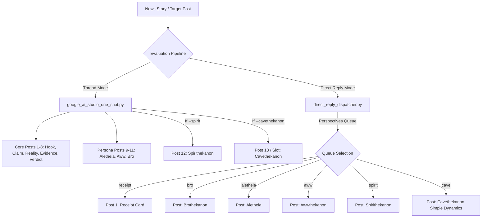

# Implementation Plan v30: Cavethekanon Active-Potential Dynamics (Simple Speak Persona)

## 1. Executive Summary & Core Directive
This plan details the design and non-breaking integration of **Cavethekanon** as an **optional persona** within the Bluesky bot ecosystem.
- **NOT Cartoon Roleplay**: No fictional caveman tropes, "Grog", grunts, club/mammoth jokes, or caricature dialogue.
- **Simple Speak Dynamics**: A persona that strips away all dense academic jargon, complex terminology, and decimal coordinates ($υ, \psi$), replacing them with direct, plain English statements of **active-potential dynamics** and **discrete magnitudes**.
- **Strictly Opt-In**: The default thread generation, batch validation, and posting pipelines remain 100% unchanged. Cavethekanon is an optional post slot and perspective that can be enabled via CLI flags, queue selectors, or launcher toggles.

---

## 2. Theoretical Grounding: Active-Potential Dynamics Diagram

Based on the bedrock vector diagram (`media_1791100109539.png`):

### 2.1 The Two Fundamental Axes
1. **Horizontal Axis ($υ$ - Scope of Energy / Beneficiary)**:
   - **Inclusive ($υ > 0$)**: Outward, shared, whole-system, communal, open access.
   - **Exclusive ($υ \le 0$)**: Inward, private, extracted, gated, in-group privilege.
2. **Vertical Axis ($\psi$ - Nature of Energy / Force)**:
   - **Latent Active ($\psi > 0$)**: Pushing forward, generating momentum, expanding, transforming.
   - **Latent Counteractive ($\psi \le 0$)**: Inertial holdback, braking, grounding, resisting, stabilizing.

### 2.2 The 4 Corner Movements & Outward Projections
- **Top-Left (Inclusive + Latent Active)**:
  - **Movement**: `productive`
  - **Outward Projection**: `can be` (the horizon of new possibility created for everyone).
- **Top-Right (Exclusive + Latent Active)**:
  - **Movement**: `reductive`
  - **Outward Projection**: `is not` (denying reality, stripping complexity to hoard advantage).
- **Bottom-Right (Exclusive + Latent Counteractive)**:
  - **Movement**: `regress`
  - **Outward Projection**: `was like` (clinging to past dominance or nostalgia to prevent progress).
- **Bottom-Left (Inclusive + Latent Counteractive)**:
  - **Movement**: `constructive`
  - **Outward Projection**: `is like` (grounding shared patterns into tangible institutional foundations).
- **Center Bedrock**:
  - `is` (the objective reality / unvarnished ground truth).

### 2.3 The Natural Cycle
$$\text{constructive (is like)} \longrightarrow \text{productive (can be)} \longrightarrow \text{reductive (is not)} \longrightarrow \text{regress (was like)} \longrightarrow \text{constructive (is like)}$$

### 2.4 Discrete Magnitude Scale (Replacing Decimal Coordinates)
Instead of reporting decimal coordinates like $(\upsilon = +0.65, \psi = +0.82)$, Cavethekanon reports discrete magnitudes:
- **`small small`**: Barely there / negligible / faint drift ($0.00 \le |val| < 0.25$)
- **`small`**: Noticeable / localized / moderate effect ($0.25 \le |val| < 0.55$)
- **`big`**: Strong / dominant / driving force ($0.55 \le |val| < 0.85$)
- **`big big`**: Massive / systemic / overwhelming ($0.85 \le |val| \le 2.00$)

Pairs naturally with the 4 movements:
- `"big productive"` / `"small small productive"`
- `"big reductive"` / `"small reductive"`
- `"big big regress"` / `"small regress"`
- `"big constructive"` / `"small constructive"`

---

## 3. Cavethekanon Persona Voice & Examples

### 3.1 Persona Guidelines
- **Vocabulary**: Common, everyday monosyllabic or disyllabic words.
- **Structure**: Short, clear sentences. State what is happening, what kind of push it is, how big it is, and where it is going.
- **Rule**: Never use words like "hegemonic", "ontological", "vector field", "asymmetry", "epistemic".
- **Format**:
  ```text
  Cavethekanon:
  [Magnitude + Vector description]. [Plain explanation of the push/drag]. [Projection: can be / is not / was like / is like]. [Grounded verdict].
  ```

### 3.2 Concrete Examples
- **Example 1 (Clean Energy Investment / Infrastructure)**:
  > *Cavethekanon:*
  > *This is big productive. People are putting real energy out to build what can be. It helps everyone, not just one tribe. There is small reductive pushback from people who want to hold cash back, but the constructive base is solid.*

- **Example 2 (Corporate Bailout / Subsidy Extraction)**:
  > *Cavethekanon:*
  > *This is big big reductive. Strong push, but only for the few. They say it helps all, but it is not true. It pulls the whole group into regress, trying to make things like they were before. Energy is being taken, not made.*

- **Example 3 (Bureaucratic Delay / Token Review)**:
  > *Cavethekanon:*
  > *Small small constructive. Lots of talk, almost zero active push. It is stuck in counteractive hold. Feels like trying to keep things quiet rather than building what can be.*

---

## 4. Integration Architecture (Non-Breaking / Opt-In)



### 4.1 Thread Generation (`google_ai_studio_one_shot.py`)
- **Default Behavior**: Untouched. Existing prompt generates 11 posts (or 12 with Spirithekanon).
- **Opt-In Switch**: `--include-cavethekanon` (or configured via state/argument).
- When active, the system instruction adds:
  ```text
  Cavethekanon Persona:
  Evaluate the story using simple active-potential dynamics:
  - Magnitudes: 'small small', 'small', 'big', 'big big'
  - Vectors: 'productive' (can be), 'reductive' (is not), 'regress' (was like), 'constructive' (is like)
  - Style: Short, clear, plain English. No jargon. No cartoon caveman voice.
  Output line format:
  Cavethekanon:
  [Simple speak evaluation]
  ```

### 4.2 Batch Validation (`validate_batch.py`)
- Schema check allows threads with or without Cavethekanon.
- If a post starts with `Cavethekanon:`, it verifies:
  1. Under 300 characters.
  2. Contains at least one magnitude keyword (`small small`, `small`, `big`, `big big`).
  3. Contains at least one vector keyword (`productive`, `reductive`, `regress`, `constructive`).
  4. Does NOT contain cartoon jargon (`grog`, `grunt`, `club`, `mammoth`).

### 4.3 Direct Reply & Crossref Flow (`direct_reply_dispatcher.py` & `audit_crossref.py`)
- Add `'cave'` as an allowed key in `--perspectives` (e.g. `--perspectives "receipt;cave"` or `--perspectives "receipt;bro;cave"`).
- In `direct_reply_dispatcher.py`, map `cave` to format a simple-speak reply based on the calculated audit coordinates:
  - Calculate vector from $(\upsilon, \psi)$:
    - $\psi > 0, \upsilon > 0 \rightarrow$ `productive` (`can be`)
    - $\psi > 0, \upsilon \le 0 \rightarrow$ `reductive` (`is not`)
    - $\psi \le 0, \upsilon \le 0 \rightarrow$ `regress` (`was like`)
    - $\psi \le 0, \upsilon > 0 \rightarrow$ `constructive` (`is like`)
  - Calculate magnitude from Euclidean distance / coordinate values:
    - $< 0.35 \rightarrow$ `small small`
    - $< 0.70 \rightarrow$ `small`
    - $< 1.20 \rightarrow$ `big`
    - $\ge 1.20 \rightarrow$ `big big`

### 4.4 Operator GUI (`AletheiaLauncher.pyw`)
- Add a `+ Cavethekanon` button to the Perspective Queue toolbar next to `+ Brothekanon`, `+ Alethekanon`, `+ Awwthekanon`, `+ Spirithekanon`.
- Clicking it adds `🪨 Post: Cavethekanon Simple Dynamics` to the draggable reply queue.
- Drag-and-drop parser maps `cave` in the queue listbox directly to `--perspectives ... cave`.

---

## 5. Verification & Testing Protocol (Zero Token Waste)
1. **Unit Test / Dry Run**:
   - Write a standalone test script `tests/test_cavethekanon_mapping.py` that tests the coordinate-to-vector and magnitude mapping with synthetic values. Zero API calls.
2. **Local Schema Validation**:
   - Validate synthetic story JSONs containing Cavethekanon posts through `validate_batch.py` to ensure parsing passes seamlessly. Zero API calls.
3. **GUI Verification**:
   - Verify `AletheiaLauncher.pyw` parses the queue items without launch errors. Zero live posts.

---

## 6. Decision & Approval Checkpoints
Before any code changes begin:
1. **User Review**: Does this capture the exact intended simple-speak dynamic?
2. **Post Placement**: Should Cavethekanon be an optional 13th post in full threads, or primarily for direct reply threads and targeted responses?
3. **Queue Default**: In the Launcher, should the default queue remain `[Receipt, Brothekanon]` or have Cavethekanon selectable on demand?
